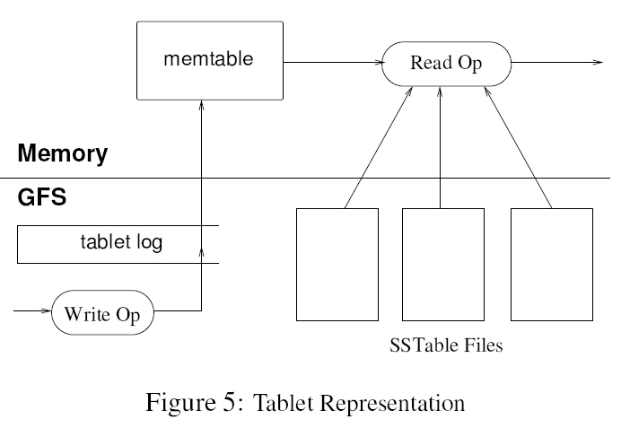
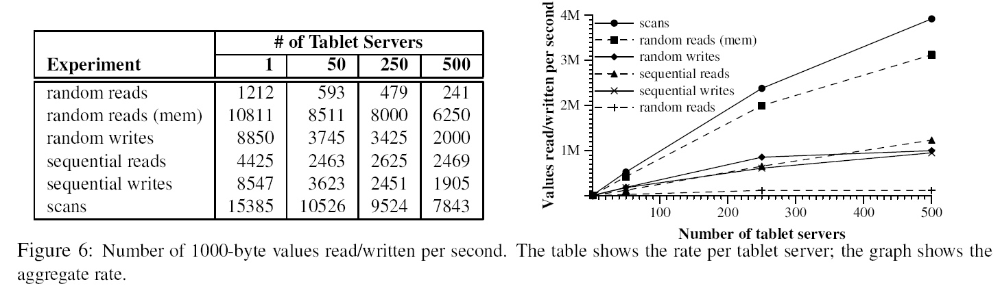
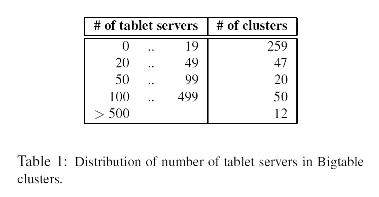
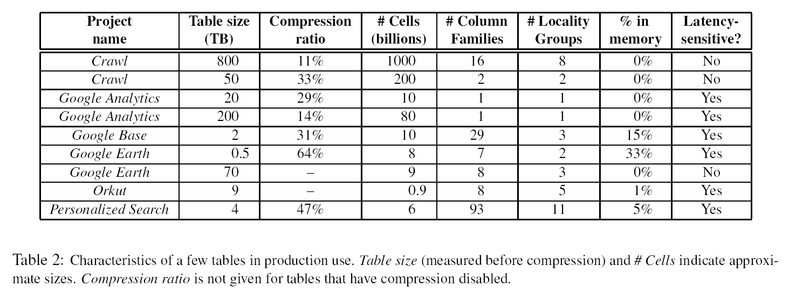

本文翻译：厦门大学计算机系 林子雨（<http://www.cs.xmu.edu.cn/linziyu>）  翻译时间：2010年7月

本文原始英文目录：

Abstract

1 Introduction

2 Data Model

Rows

Column Families

Timestamps

3 API

4 Building Blocks

5 Implementation

5.1 Tablet Location

5.2 Tablet Assignment

5.3 Tablet Serving

5.4 Compactions

6 Refinements

Locatity groups

compression

Caching for read performance

Bloom filters

Commit-log implementation

Speeding up tablet recovery

Exploiting immutability

7 Performance Evaluation

Single-tablet-server performance

Scaling

8 Real applications

8.1 Google Analytics

8.2 Google Earth

8.3 Personalized Search

9 Lessons

10 Related Work

11 Conclusions

Acknowledgements

References

[本文翻译的原始出处：厦门大学计算机系数据库实验室网站林子雨老师的云数据库技术资料专区[http://dblab.xmu.edu.cn/topic/research/documentation/cloud_database/](http://dblab.xmu.edu.cn/topic/research/documentation/cloud-database/)]

**Google Bigtable (中文版)**

厦门大学计算机系教师  林子雨  翻译；  翻译时间：2010年7月

**Abstract**

​        BigTable是一个分布式存储系统，它可以支持扩展到很大尺寸的数据：PB级别的数据，包含几千个商业服务器。Google的许多项目都存储在BigTable中，包括WEB索引、Google Earth 和Google Finance。这些应用对BigTable提出了截然不同的需求，无论是从数据量（从URL到网页到卫星图像）而言，还是从延迟需求（从后端批量处理到实时数据服务）而言。尽管这些不同的需求，BigTable已经为所有的Google产品提供了一个灵活的、高性能的解决方案。本文中，我们描述了BigTable提供的简单数据模型，它允许客户端对数据部署和格式进行动态控制，我们描述了BigTable的设计和实施。

中文关键词：谷歌；分布式存储系统；键值存储；数据库；云数据库；

英文关键词：Google Bigtable;key-value store; database; cloud database;distributed storage system

**1 Introduction**

​        在过去的两年半时间里，我们已经设计、实施和部署了一个分布式存储系统BigTable，来管理Google当中的结构化数据。BigTable被设计成可以扩展到PB的数据和上千个机器。BigTable已经达到了几个目标：广泛应用性、可扩展性、高性能和高可用性。Google的六十多款产品和项目都存储在BigTable中，包括Google Analytics和Google Finance，Orkut，Personalized Search，Writely和Google Earth。这些产品使用BigTable来处理不同类型的工作负载，包括面向吞吐量的批处理作业以及对延迟敏感的终端用户数据服务。这些产品所使用的BigTable的簇，涵盖了多种配置，从几个到几千个服务器，并且存储了几百TB的数据。

​        在许多方面，BigTable都和数据库很相似，它具有和数据库相同的实施策略。并行数据库[14]和内存数据库[13]已经取得了可扩展性和高性能，但是BigTable提供了和这些系统不一样的接口。BigTable不能支持完整的关系型数据模型，相反，它为客户提供了一个简单数据模型，该数据模型可以支持针对数据部署和格式的动态控制，并且可以允许用户去推理底层存储所展现的数据的位置属性。BigTable使用行和列名称对数据进行索引，这些名称可以是任意字符串。BigTable把数据视为未经解释的字符串，虽然，客户可能经常把不同格式的结构化数据和非结构化数据都序列化成字符串。最后，BigTable模式参数允许用户动态地控制，是从磁盘获得数据还是从内存获得数据。

​        本文第2部分详细描述了数据模型，第3部分大概介绍了用户API，第4部分简要介绍了BigTable所依赖的Google底层基础设施，第5部分描述了BigTable的实施方法，第6部分描述了我们针对BigTable做的性能改进，第7部分提供了BigTable的性能衡量方法，第8部分给出了几个实例来介绍 Google如何使用BigTable，第9部分介绍了我们在设计和支持BigTable过程中得到的经验教训。最后，在第10部分介绍相关工作，第11部分给出结论。

**2 Data Model**

​        一个BigTable是一个稀疏的、分布的、永久的多维排序图。我们采用行键盘（row key）、列键（column key）和时间戳（timestamp）对图进行索引。图中的每个值都是未经解释的字节数组。

(row:string, column string, time:int64)→string

​        我们在检查了类似BigTable的系统的多种应用以后，才决定采用这种数据模型。这里给出一个实际的例子来阐释为什么我们采用数据模型设计。假设我们想要拷贝一个可能被很多项目都是用的、很大的网页集合以及相关的信息，让我们把这个特定的表称为Webtable。在Webtable当中，我们使用URL作为行键，网页的不同方面作为列键，并把网页的内容存储在contents:column中，如图1所示。


*图1 存储了网页数据的Webtable的一个片段。行名称是反转的URL，contents列家族包含了网页内容，anchor列家族包含了任何引用这个页面的anchor文本。CNN的主页被Sports Illustrated和MY-look主页同时引用，因此，我们的行包含了名称为”anchor:cnnsi.com”和”anchor:my.look.ca”的列。每个anchor单元格都只有一个版本，contents列有三个版本，分别对应于时间戳t3,t5和t6。*

**Rows**

​        一个表中的行键，是任意的字符串（当前在尺寸上有64KB，虽然10-100字节是用户最常用的尺寸）。对每个行键下所包含的数据的读或写都是一个原子操作，不管这个行中所包含的列的数量是多少。这种设计决定可以使得当针对同一行发生并发更新行为时，用户很容易知道系统的行为。

​        BigTable在行键上根据字典顺序对数据进行维护。对于一个表而言，行区间是动态划分的。每个行区间称为一个Tablet，它是负载均衡和数据分发的基本单位。因而，读取一个比较短的行区间是非常高效的，通畅只需要和少数几个机器通讯。用户可以利用这种属性，也就是说，用户可以选择分布具有局部性的行区间。例如，在Webtable中，通过对URL地址进行反转，属于同一个领域的网页都会被分组到连续的行中。例如，我们在键com.google.maps/index.html下面存储com.google.maps/index.html中包含的数据。把来自同一个领域的数据彼此临近存储，使得一些领域分析更加高效。

**Column Families**

​        列键被分组成称为“列家族”的集合，它成为基本的访问控制单元。存储在一个列家族当中的所有数据，通常都属于同一个数据类型（我们对同一个列家族中的数据一起进行压缩）。数据可以被存放到列家族的某个列键下面，但是，在把数据存放到这个列家族的某个列键下面之前，必须首先创建这个列家族。在创建完成一个列家族以后，就可以使用同一个家族当中的列键。我们的意愿是，让一个表当中所包含的列家族的数量尽可能少（至多几百个列家族），而且，在操作过程当中，列家族很少发生变化。相反，一个表可以包含无限数量的列。

​        列键采用下面的语法命名：family:qualifier。列家族名字必须是可打印的，但是，修饰符qualifier可以是任意字符串。比如，对于Webtable而言，有一个列家族是language，它存储了网页所用语言的信息。在language列家族中，我们只使用一个列键，它存储了每个网页语言的ID。Webtable当中另一个有用的列家族就是anchor，这个列家族中的每个列键都代表了一个单个的anchor，如图1所示。它的修饰符qualifier是引用网站的名称，这个单元格内容是链接文本。

​        访问控制以及磁盘和内存审计是在列家族层面上进行的。以Webtable为例，这些控制允许我们管理几种不同类型的应用，一些应用负责增加新的基本数据，一些应用负责读取基本数据并且创建衍生的列家族，一些应用则只被允许浏览现有的数据（甚至，如果出于隐私保护考虑，无法浏览全部列家族）。

**Timestamps**

​        在BigTable中的每个单元格当中，都包含相同数据的多个版本，这些版本采用时间戳进行索引。BitTable时间戳是64位整数。BigTable对时间戳进行分配，时间戳代表了真实时间，以微秒来计算。客户应用也可以直接分配时间戳。需要避免冲突的应用必须生成唯一的时间戳。一个单元格的不同版本是根据时间戳降序的顺序进行存储的，这样，最新的版本可以被最先读取。

​        为了减轻版本数据的管理负担，我们支持两种“每列家族”设置，它会告诉BigTable来自动垃圾收集（garbage-collect）单元格版本。用户可以设定只保存单元格中数据的最近n个版本，或者只保存足够新版本（比如只保存最近7天内的数据版本）。

​        在我们的Webtable实例当中，我们为存储在contents:column中的网页设置时间戳，时间戳的数值就是这个网页的这个版本被抓取的真实时间。上面所描述的垃圾收集机制，允许我们只保留每个网页的最近三个版本。

**3 API**

​        BigTable的API提供了删除和创建表和列家族的功能。它还提供了改变簇、表和列家族的元数据，比如访问控制权限。

​        客户应用可以书写和删除BigTable中的值，从单个行中查询值，或者对表中某个数据子集进行遍历。图2显示了一段C++代码，它使用了RowMutation来执行一系列的更新（为了更好地理解这个例子，已经忽略了不相关的细节）。对Apply的调用，会执行一个针对Webtable的原子更新操作：它增加一个anchor到[www.cnn.com](http://www.cnn.com/)中去，并且删除一个不同的anchor。

```
// Open the table
Table *T = OpenOrDie(“/bigtable/web/webtable”);
// Write a new anchor and delete an old anchor
RowMutation r1(T, “com.cnn.www”);
r1.Set(“anchor:www.c-span.org”, “CNN”);
r1.Delete(“anchor:www.abc.com”);
Operation op;Apply(&op, &r1);
```

图2: Writing to Bigtable.

​        图3显示了一段C++代码，它使用了Scanner来遍历某个行中的所有anchor（厦门大学林子雨标注：中文可以翻译成“锚”）。客户端可以遍历多个列家族，并且有几种机制可以用来对一次扫描中所产生的行、列和时间戳的数量进行限制。例如，我们可以对上面的扫描进行限制，让所产生的anchor所在的列与正则表达式匹配anchor:*.cnn.com，或者只产生那些时间戳距离当前时间10天以内的anchor。

```
Scanner scanner(T);

ScanStream *stream;

stream = scanner.FetchColumnFamily(“anchor”);

stream->SetReturnAllVersions();

scanner.Lookup(“com.cnn.www”);

for (; !stream->Done(); stream->Next()) {

printf(“%s %s %lld %sn”,

scanner.RowName(),

stream->ColumnName(),

stream->MicroTimestamp(),

stream->Value());

}
```

图3: Reading from Bigtable.

​        BigTable支持几种其他的功能，允许用户以更加复杂的方式来操作数据。首先，BigTable支持单行事务，可以允许对存储在某个行键下面的数据执行原子的“读-修改-写”操作。BigTable当前不支持通用的跨行键的事务，虽然它在客户端提供了跨行键批量写入数据的接口。其次，BigTable允许单元格被用来作为整数计数器。最后，BigTable支持在服务器的地址空间内执行客户端提供的脚本。这种脚本是用称为Sawzall的语言开发的，这种语言是Google开发出来进行数据处理的。目前，基于Sawzall的API不允许客户端脚本对BigTable执行回写操作，但是，它确实允许不同类型的数据转换、基于任意表达式的过滤以及针对不同类型操作符的总结。

​        BigTable可以和MapReduce[12]一起使用，MapReduce是Google开发的、用来运行大规模并行计算的框架。我们已经书写了一个Wrapper集合，它允许BigTable被用来作为一个MapReduce作业的输入源或者输出目标。

 

**4 Building Blocks**

​        BigTable是构建在其他几个Google基础设施之上的。BigTable使用了分布式Google文件系统（GFS[17]）来存储日志和数据文件。BigTable的一个簇通常在一个共享机器池内进行操作，这个共享机器池会运行其他一些分布式应用。BigTable的进程通常和其他应用的进程共享同样的机器。BigTable依赖一个簇管理系统来调度作业、在共享机器上调度资源、处理机器失败和监督机器状态。

​        Google SSTable文件格式作为存储BigTable数据的内部格式。一个SSTable提供一个持久化的、排序的、不可变的、从键到值的映射，其中，键和值都是任意的字节字符串。BigTable提供了查询与一个指定键相关的值的操作，以及在一个指定的键区间内遍历所有的“键/值对”的操作。在内部，每个SSTable都包含一个块序列。通常，每个块是64KB，不过块尺寸是可配置的。存储在SSTable结尾的块索引，可以用来快速定位块的位置。当SSTable被打开时，块索引就会被读入内存。一个查询操作只需要进行一次磁盘扫描，我们首先在内存的块索引当中使用二分查找方法找到合适的块，然后从磁盘中读取相应的块。可选地，一个SSTable可以被完全读入内存，这样，我们在进行查找操作时，就不需要读取磁盘。

​        BigTable依赖一个高可用的、持久性的分布式锁服务Chubby[8]。一个Chubby服务包含5个动态副本，其中一个被选作主副本对外提供服务。当大部分副本处于运行状态并且能够彼此通信时，这个服务就是可用的。Chubby使用Paxos算法[9][23]来使它的副本在失败时保持一致性。Chubby提供了一个名字空间，它包含了目录和小文件。每个目录和文件可以被用作一个锁，针对文件的读和写操作都是原子的。Chubby客户端函数库提供了针对Chubby文件的持久性缓存。每个Chubby客户端维护一个session，这个session具备Chubby服务。如果租约过期以后不能及时更新session的租约，那么这个客户端的session就会过期。当一个客户端的session过期时，它会丢失所有锁，并且放弃句柄。Chubby客户端也可以注册针对Chubby文件和目录的回调服务（callback），从而通知session过期或其他变化。

​        BigTable使用Chubby来完成许多任务：（1）保证在每个时间点只有一个主副本是活跃的，（2）来存储BigTable数据的bootstrap的位置（见5.1节），（3）来发现tablet服务器，（4）宣告tablet服务器死亡，（5）存储BigTable模式信息（即每个表的列家族信息），以及（6）存储访问控制列表。如果在一段时间以后，Chubby变得不可用，BigTable就不可用了。我们最近对涵盖11个Chubby实例的14个BigTable簇进行了这方面的效果测试。由于Chubby的不可用（可能由于Chubby过时，或者网络故障），而导致一些存储在BigTable中的数据变得不可用，这种情形占到BigTable服务小时的平均比例值是0.0047%。单个簇的百分比是0.0326%。

**5 Implementation**

​        BigTable实现包括三个主要的功能组件：(1)库函数：链接到每个客户端，（2）一个主服务器，（3）许多Tablet服务器。Tablet服务器可以根据工作负载的变化，从一个簇中动态地增加或删除。主服务器负责把Tablet分配到Tablet服务器，探测Tablet服务器的增加和过期，进行Table服务器的负载均衡，以及GFS文件系统中的垃圾收集。除此以外，它还处理模式变化，比如表和列家族创建。

​        每个Tablet服务器管理一个Tablet集合，通常，在每个Tablet服务器上，我们会放置10到1000个Tablet。Tablet服务器处理针对那些已经加载的Tablet而提出的读写请求，并且会对过大的Tablet进行划分。

​        就像许多单服务器分布式存储系统一样[17,21]，客户端并不是直接从主服务器读取数据，而是直接从Tablet服务器上读取数据。因为BigTable客户端并不依赖于主服务器来获得Tablet的位置信息，所以，大多数客户端从来不和主服务器通信。从而使得在实际应用中，主服务器负载很小。

​        一个BigTable簇存储了许多表。每个表都是一个Tablet集合，每个Tablet包含了位于某个域区间内的所有数据。在最初阶段，每个表只包含一个Tablet。随着表的增长，它会被自动分解成许多Tablet，每个Tablet默认尺寸大约是100到200MB。

**5.1 Tablet Location**

我们使用了一个类似于 B+树的三层架构（如图4所示），来存储Tablet位置信息。

.jpg)

第一个层次是一个文件，存储在Chubby中，它包含了Toot Tablet的位置信息。Root Tablet把Tablet的所有位置信息都保存在一个特定的METADATA表中。每个METADATA表都包含了一个user tablet集合的位置信息。Root Tablet其实就是METADATA表当中的第一个Tablet，但是，它被区别对待，它在任何情况下都不会被拆分，从而保证Tablet位置层次结构不会超过三层。

METADATA表存储了属于某个行键的Tablet的位置信息，所谓行键，就是关于Tablet表标识符和它的最后一行这二者的编码。每个METADATA行，大约在内存中存储了1KB的数据。由于采用了128M大小的METADATA Tablet的适当限制，我们的三层位置模式足够用来存放2的34此方的Tablet的位置信息。

客户端函数库会缓存Tablet位置信息。如果客户端不知道一个Tablet的位置信息，或者它发现，它所缓存的Tablet位置信息部正确，那么，它就会在Tablet位置层次结构中依次向上寻找。如果客户端缓存是空的，那么定位算法就需要进行三次轮询，其中就包括一次从Chubby中读取信息。如果客户端的缓存是过期的，定位算法就要进行六次轮询，因为，只有在访问无效的时候才会发现缓存中某个entry是过期的（这里假设METADATA Tablets不会频繁移动）。虽然，Tablets位置信息是保存在缓存中，从而不需要访问GFS，但是，我们仍然通过让客户端库函数预抓取tablet位置信息，来进一步减少代价，具体方法是：每次读取METADATA表时，都要读取至少两条以上的Tablet位置信息。

我们也在METADATA表中存储了二级信息，包括一个日志，它记载了和每个tablet有关的所有事件，比如，一个服务器什么时候开始提供这个tablet服务。这些信息对于性能分析和程序调试是非常有用的。

**5.2 Tablet Assignment**

​        在每回，每个Tablet可以被分配到一个tablet服务器。主服务器跟踪tablet服务器的情况，掌握当前tablet被分配到tablet服务器的情况，其中包括哪个tablet还没有被分配。当一个tablet没有被分配，并且一个具有足够空间可以容纳该tablet的tablet服务器是可用时，主服务器就把当前这个tablet分配给这个tablet服务器，主服务器会向tablet服务器发送一个tablet负载请求。

​        BigTable使用Chubby来跟踪tablet服务器。当一个Tablet服务器启动的时候，它创建并且获得一个独占的排他锁，这个锁会锁住一个特定的Chubby目录中的一个唯一命名的文件。主服务器监视这个目录（服务器目录），来发现tablet服务器。如果一个tablet服务器停止服务，它就会丢失这个锁，比如，由于网络故障，导致这个tablet服务器丢失了这个Chubby会话。（Chubby提供了一个完善的机制，来允许一个tablet服务器检查自己是否已经丢失了这个独占排他锁）。如果丢失了锁，那么，只要目录中的这个文件还存在，那么一个tablet服务器就会努力去获得这个锁。如果文件不再存在，那么，这个tablet服务器就不再能够对外提供服务，因此，它就自杀。一旦一个tablet服务器终止了服务（比如，簇管理系统把这个tablet服务器从簇中移除），它就会努力释放锁，这样，主服务器就可以更快地重新分配这个tablet。

​        主服务器需要探测，什么时候tablet服务器不再提供tablet服务，并且要负责尽快对这些tablet进行重新分配。为了探测什么时候tablet服务器不再提供tablet服务，主服务器会周期性地询问每个tablet服务器，了解他们的锁的状态。如果一个tablet服务器报告，它已经丢失了锁；或者，在最近的几次尝试中，主服务器都无法与tablet服务器取得联系，主服务器就会努力获得一个针对这个服务器文件的独占排他锁。如果主服务器可以获得这个锁，那么，Chubby就是可用的，相应地，这个tablet服务器或者已经死亡，或者有些故障导致它无法到达Chubby。因此，主服务器就从Chubby中删除这个tablet服务器的文件，从而确保这个tablet服务器不再能够提供服务。一旦一个服务器文件被删除，主服务器就可以把所有以前分配给该服务器的tablet，都移动到“待分配”tablet集合。为了保证一个BigTable簇不会轻易受到主服务器和Chubby之间的网络故障的影响，如果一个主服务器的Chubby会话过期了，这个主服务器就会自杀。但是，正如上所述，主服务器失效，不会改变tablet到table的分配。

​        当一个主服务器被簇管理系统启动时，在它能够改变tablet分配之前，它必须首先了解当前的tablet分配信息。为此，在启动的时候，主服务器会执行以下步骤：（1）主服务器在Chubby中抓取一个独特的master lock，这就防止了多个主服务器并发启动的情形。（2）主服务器扫描Chubby中的服务器目录，从而发现当前可用的服务器。（3）主服务器和当前每个可用的tablet服务器通信，来发现哪些tablets已经被分配到哪个tablet服务器。（4）主服务器扫描METADATA表来学习tablets表集合。一旦在扫描过程中，主服务器发现某个tablet还没有被分配，主服务器就把这个tablet放置到“待分配”tablet集合，这就使得这些tablet可以进入待分配状态。

​        一个比较复杂的情况是，在METADATA tablets被分配之前，我们是不能扫描METADATA表的。因此，在开始扫描（步骤4）之前，如果主服务器在步骤3的扫描中发现root tablet没有被发现，主服务器把root tablet增加到待分配tablet集合。这个增加，保证了root tablet一定会被分配。因为，root tablet包含了所有METADATA tablets的名字。主服务器只有在扫描了root tablet以后，才可能知道所有这些METADATA tablets的名字。

​        现有的tablet集合，只有在以下情形才会发生改变：（1）当一个tablet被创建或删除；（2）对两个现有的tablet进行合并得到一个更大的tablet；（3）一个现有的tablet被分割成两个较小的tablet。主服务器可以跟踪这些变化。Tablet分裂会被特殊对待，因为，它是由一个tablet服务器发起的。Tablet服务器通过把信的tablet信息记录在METADATA表中，来提交分裂操作。当分裂被提交以后，这个tablet服务器会通知主服务器。为了防止分裂通知丢失（或者由于主服务器死亡或者由于tablet服务器死亡），当主服务器要求一个tablet服务器加载已经被分裂的tablet时，主服务器会对这个新的tablet进行探测。Tablet服务器会把分裂的情况告知主服务器，因为，它在METADATA表中所找到的tablet entry，只能确定主服务器要求它加载的数据的一部分。

**5.3 Tablet Serving**



一个tablet的持久化存储是存在GFS当中，如图5所示。更新被提交到一个提交日志，日志中记录了redo记录。在这些更新当中，最近提交的更新被存放到内存当中的一个被称为memtable的排序缓冲区，比较老的更新被存储在一系列SSTable中。为了恢复一个tablet，tablet服务器从METADATA表当中读取这个tablet的元数据。这个元数据包含了SSTable列表，其中，每个SSTable都包括一个tablet和一个重做点（redo point）的集合，这些redo point是一些指针，它们指向那些可能包含tablet所需数据的重做日志。服务器把SSTable索引读入内存，并且重构memtable，方法是，执行重做点以后的所有已经提交的更新。

当一个写操作到达tablet服务器，服务器首先检查它是否是良好定义的，并且发送者是否被授权执行该操作。执行授权检查时，会从一个Chubby文件中读取具有访问权限的写入者的列表，这个Chubby文件通常总能够在Chubby客户端缓存中找到。一个有效的变化，会被写到提交日志中。分组提交是为了改进许多小更新[13,16]操作的吞吐量。在写操作已经被提交以后，它的内容就会被插入到memtable。

当一个读操作到达Tablet服务器，与写操作类似，服务器也会首先检查它是否是良好定义和得到授权的。一个有效地读操作是在以下二者的合并的基础上执行的，即一系列SSTable和memtable。由于SSTable和memtable是字典排序的数据结构，合并视图的执行是非常高效的。

当tablet发生合并或分解操作时，正在到达的读写操作仍然可以继续进行。

**5.4 Compactions**

​        随着写操作的执行，memtable的尺寸逐渐增加。当memtable的尺寸到达一个门槛值的时候，memtable就被冻结，就创建一个新的memtable，被冻结的memtable就转化成一个SSTable，并被写入到GFS。这个“次压缩”（minor compaction）过程有两个目标：（1）它缩减了tablet服务器的内存使用率；（2）当发生服务器死亡需要恢复时，它减少了需要从重做日志中读取的数据量。当压缩过程正在进行时，正在到达的读写操作仍然可以继续进行。

​        每一次小压缩都会创建一个新的SSTable，如果这种行为没有限制地持续进行，读操作可能需要从任意数量的SSTable中合并更新。相反，我们会对这种文件的数量进行限制，我们在后台周期性地运行一个合并压缩程序。一个合并压缩程序从一些SSTable和memtable中读取内容，并且写出一个新的SSTable。一旦压缩过程完成，这个输入的SSTable和memtable就可以被删除。

​        一个合并压缩程序，把所有的SSTable的数据重写到一个SSTable，这个合并压缩被称为“主压缩”（major compaction）。非主压缩所产生的SSTable可以包含特殊的删除入口（entry），它把被删除的数据压缩在仍然存活的比较老的SSTable当中。另一方面，一个主压缩过程，产生一个SSTable，它不包含删除信息或被删除的数据。BigTable定期检查它的所有tablet，并执行主压缩操作。这些主压缩过程可以允许BigTable收回被删除数据占用的资源，并且保证被删除数据在一定时间内就可以从系统中消失，这对于一些存储敏感数据的服务来说是非常重要的。

**6 Refinements**

   以前章节所描述的实现，需要一系列完善措施从而获得高性能、可用性和可靠性，这些都是我们的用户所要求的。这部分内容更详细介绍实现细节。

**Locatity groups**

​        客户端可以把多个列家族一起分组到一个locality group中。我们会为每个tablet中的每个locality group大都创建一个单独的SSTable。把那些通常不被一起访问的列家族分割到不同的locality group，可以实现更高效的读。例如，在WebTable当中的页元数据（比如语言和校验码），可以被放置到同一个locality group当中，网页的内容可以被放置到另一个locality group当中。那些想要读取页面元数据的应用，就不需要访问所有的页面内容。

​        除此以外，一些有用的参数，可以针对每个locality group来设定。例如，一个locality group可以设置成存放在内存中。常驻内存的locality group的SSTable，采用被动加载的方式被加载tablet服务器的内存，即只有应用请求SSTable中的数据，而这些数据又不在内存中时，才把SSTable加载到内存。一旦加载，属于这些locality group的列家族，就可以被应用直接访问，而不需要读取磁盘。这个特性对于那些被频繁访问的小量数据来说是非常有用的。

**Compression**

客户端可以决定是否对相应于某个locality group的SSTable进行压缩，如果压缩，应该采用什么格式。用户自定义的压缩格式可以被应用到每个SSTable块中（块的尺寸可以采用与locality group相关的参数来进行控制）。虽然对每个块进行单独压缩会损失一些空间，但是，我们可以从另一个方面受益，当解压缩时，只需要对小部分数据进行解压，而不需要解压全部数据。许多客户端都使用“两段自定义压缩模式”。第一遍使用Bentley and McIlroy[6]模式，它对一个大窗口内的长公共字符串进行压缩。第二遍使用一个快速的压缩算法，这个压缩算法在一个16KB数据量的窗口内寻找重复数据。两个压缩步骤都非常快，在现代计算机上运行，他们编码的速度是100-200MB/S，解码的速度在400-1000MB/S。

当选择我们的压缩算法时，即使我们强调速度而不是空间压缩率，这个两段压缩模式也表现出了惊人的性能。例如，在WebTable中，我们使用这种压缩模式来存储网页内容。在其中一个实验当中，我们在一个压缩后的locality group当中存储了大量的文档。为了达到实验的目的，我们只为每个文档存储一个版本，而不是存储我们可以获得的所有版本。这个压缩模式获得了10：1的空间压缩率。这比传统的GZip方法的效果要好得多，GZip针对HTML数据通常只能获得3:1到4:1的空间压缩率。这种性能上的改进，是和WebTable中的行的存储方式紧密相关的，即所有来自同一个站点的网页都存储在相近的位置。这就使得Bentley and McIlroy算法可以从同一个站点的网页中确定大量相似的内容。许多应用，不只是WebTable，都会很好地选择行名称，从而保证相似的数据可以被存放到同一个簇当中，这样就可以取得很好的压缩率。当我们在BigTable中存储同一个值的多个不同版本时，可以取得更好的压缩率。

**Caching for read performance**

   为了改进读性能，tablet服务器使用两个层次的缓存。Scan缓存是一个高层次的缓存，它缓存了“键–值”对，这些“键–值”对是由tablet服务器代码的SSTable接口返回的。Block缓存是比较低层次的缓存，它缓存了从GFS当中读取的SSTable块。Scan缓存对于那些频繁读取相同数据的应用来说是非常有用的。Block缓存对于那些倾向于读取与自己最近读取数据临近的数据的应用来说，是比较有用的，比如顺序读取，或者随机读取属于同一个locality group中的不同的列。

**Bloom filters**

​    正如5.3节阐述的那样，一个读操作必须从构成一个tablet的当前状态的所有SSTable中读取数据。如果这些SSTable不在内存中，我们就不得不需要很多磁盘访问。我们通过下面的方式来减少磁盘访问，即允许客户端来确定，为某个特定locality group中的SSTable创建Bloom filter[7]。一个Bloom filter允许我们询问，一个SSTabble是否包含属于指定的“行–列队”的特定的数据。对于某个特定的应用，一个用来存储Bloom filter的很少量的tablet服务器内存空间，都可以极大减少读操作的磁盘访问次数。我们使用Bloom filter也意味着，许多针对目前不存在的行或列的查询，根本就不需要访问磁盘。

**Commit-log implementation**

​        如果我们为每个tablet都设置一个单独的文件来保存提交日志，那么，在GFS中，会有大量的文件并发写操作。取决于每个GFS服务器底层文件系统的实现方式，这些写操作会引起大量的磁盘访问。除此以外，让每个tablet都有一个单独的日子文件，会降低分组提交优化的效率。为了解决这些问题，我们对每个tablet服务器具备一个独立日志文件这种方式进行了补充，不是把更新都写入相应tablet的独立文件中，而是把几个不同tablet的更新内容都添加到一个同样的物理日志文件中[18][20]。

​        使用单个日志文件，明显改善了普通操作时的性能收益，但是，它使得故障恢复变得复杂起来。当一个tablet服务器死亡，它上面承载的tablet会被重新分配到其他多个tablet服务器，每个tablet服务器通常只接收一部分tablet。为了给一个tablet恢复状态，新的tablet服务器需要根据原来tablet服务器中记载的提交日志文件，为这个tablet重新执行一遍更新操作。但是，针对这些tablet的更新操作的日子记录，都混合存放在一个日志文件中。一种方法是，让新的tablet服务器完整地读取一份提交日志文件，然后，只把恢复这个tablet时所需要的日志记录读取出来，完成恢复。但是，在这种机制下，如果有100个机器，每个都被分配了来自死亡tablet服务器的一个单独的tablet，那么，这个日志文件就必须被重复读取100遍。

​        我们通过以下的方式来避免日志的重复读写：首先以键（表，行名称，日志顺序号）的顺序对日志文件的条目（entry）进行排序。在排序得到的结果中，所有针对某个特定tablet的更新都是连续存放的，因此，可以通过一次磁盘寻找，然后顺序批量读取数据，这种方法具有较高的效率。为了实现并行排序，我们把日子文本分割成64MB为单位的分段，在不同的tablet服务器上对每个分段进行并行排序。主服务器会对排序过程进行协调，当一个tablet服务器表示需要从一些提交日志文件中恢复数据时，就需要启动排序过程。

​        书写提交日志到GFS中去，由于很多原因（比如GFS服务器上包含很多冲突操作，或者网络拥塞），有时会带来性能上的瓶颈。为了使得更新免受GFS延迟的影响，每个tablet服务器实际上有两个日子书写线程，每个线程都书写到它自己的日志中。在运行时，只有一个进程处于工作状态。如果当前活跃的日志书写线程性能比较差，那么，就切换到另一个日志书写线程。在更新日志队列中的更新就会被这个新激活的线程书写。日志条目包含了序号，这就可以帮助恢复过程删除那些由于线程切换而导致的重复的日志记录。

**Speeding up tablet recovery**

​    如果主服务器把一个tablet从一个tablet服务器转移到另一个tablet服务器。这个源tablet服务器就对这个tablet做一个次压缩（minor compaction）。通过减少tablet服务器中的提交日志中的未压缩状态的数量，压缩过程减少了恢复时间。在完成这个压缩过程以后，这个源tablet服务器就停止提供针对这个tablet的服务。在它实际上卸载这个tablet之前，这个源tablet服务器要做另一个次压缩，来删除本tablet服务器的日志中任何未压缩的状态，这些未压缩状态是在第一个次压缩进行过程中产生的。当第二个次压缩完成时，这个tablet就可以被加载到另一个tablet服务器，而不需要任何日志条目的恢复。

**Exploiting immutability**

​        除了SSTable缓存，BigTable系统的其他部分也已经被简化，这些简化基于这样一个事实，即我们所产生的所有SSTable都是不变的。例如，当我们从SSTable中读取数据时，不需要进行任何文件系统访问的同步。结果是，针对行级别的并发控制可以高效地执行。唯一发生变化的数据结构是memtable，它同时被读操作和写操作访问。为了减少读取memtable过程中的冲突，我们使得每个memtable行采取”copy-on-write”，并且允许读和写操作并行执行。

​        由于SSTable是不可变的，永久性删除数据的问题就转变成，收集废弃的SSTable。每个tablet的SSTable，都会在METADATA表中进行注册。主服务器移除废弃的SSTable，把它标记为垃圾数据集合。

​        最后，SSTable的不可变性，允许我们更快地分裂tablet，而不是为每个子tablet生成一个新的SSTable集合。我们让子tablet和父tablet共享一个SSTable集合。

**7 Performance Evaluation**

​        我们建立了一个BigTable簇，它具有N个tablet服务器，我们改变N的值，从而测试BigTable的性能和可扩展性。Tablet服务器的配置为，1GB内存，并且把数据写到GFS单元格中，这个GFS单元格包含了1786个机器，每个机器具备400GB IDE硬盘。我们让N个客户端机器产生针对BigTable的负载，从而实现测试。需要指出的是，这里我们采用的客户端的数量和tablet服务器的数量是相等的，从而保证客户端不会成为瓶颈。每个机器都有两个双核Opteron 2GHz芯片、足够的物理内存（从而能够容纳工作集产生的数据）和GB带宽的网络连接。这些机器被安排为两层树型交换网络，在根部的带宽可以达到100-200Gbps。所有这些机器都采用相同的配置，都在同一个域内，因此，任何两台机器之间的通讯时间都不会超过1微秒。

​        Tablet服务器、主服务器、测试客户端和GFS服务器都在同一个机器集合上运行。每个机器都运行一个GFS服务器。同时，一些机器还会另外运行一个tablet服务器，一个客户端进程。

​        R是BigTable的不同值的行键的数量，在选择R的值的时候，需要确保每个benchmark在每个tablet服务器上读或写大约1GB的数据量。

​        负责顺序写的benchmark，使用名称从0到R-1的行键。行键的空间被分区成10N个等尺寸区间。这些区间被中央调度器分配到N个客户端，一旦，某个客户端已经处理完前面分配到的区间后，中央调度器就立即给这个客户端分配另一个区间。这种动态分配，可以减轻其他运行于当前机器上的进程对该机器的影响。我们在每个行键下面，写了一个单个字符串。每个字符串都是随机生成的，因此，不具备可压缩性。除此以外，在不同行键下面的字符串都是不同的，这样就不会存在跨行压缩。负责随机写的benchmark也是类似的，初了行键在写之前要以R为模数进行哈希操作，从而使得在整个benchmark期间，写操作负载可以均匀分布到整个行空间内。

​        负责顺序读的benchmark产生行键的方式，也和负责顺序写的benchmark类似。但是，顺序读benchmark不是在行键下面写数据，而是读取存储在行键下面的字符串，这些字符串是由前面的顺序写benchmark写入的。类似地，随机读benchmark会以随机的方式读取随机写benchmark所写入的数据。

​        Scan benchmark和顺序读benchmark类似，但是，使用了由BigTable API所提供的支持，来扫描属于某个域区间内的所有值。使用一个scan，减少了由benchmark所执行的RPC的数量，因为，在Scan中，只需要一个RPC就可以从tablet服务器中获取大量顺序值。

​        随机读(mem) benchmark和随机读benchmark类似，但是，包含这个benchmark数据的局部群组，被标记为in-memory，因此，它是从内存中读取所需数据，而不是从GFS中读取数据。对这个benchmark而言，我们把每个tablet服务器所包含数据的数量，从1GB减少到100MB，从而可以很好地装入tablet服务器可用内存中。



​    图6显示了，当读或写1000字节的数据到BigTable中时，我们的benchmark的性能。表格内容显示了每个tablet服务器每秒的操作的数量。图显示了每秒的操作的总数量。

**Single-tablet-server performance**

​        让我们首先考虑只有一个tablet服务器的性能。随机读的性能要比其他类型的操作的性能都要差一个数量级，甚至差更多。每个随机读操作包含了，把一个64KB的SSTable块通过网络从GFS传输到一个tablet服务器，在这个块中，只有1000字节的数据会被使用。Tablet服务器大约每秒执行1200个操作，这会导致从GFS需要读取大约75MB/s。在这个过程中，带宽是足够的。许多具有这种访问模式的BigTable应用都把块大小设置为更小的值8KB。

​        从内存读取数据的随机读会更快一些，因为，每个1000字节读都是从tablet服务器内存当中读取，而不需要从GFS当中读取64KB的数据。

​        随机和顺序写执行的性能要好于随机读，因为，每个tablet服务器都把所有到达的写都追加到一个单独的提交日志中，并且使用分组提交，从而使得到GFS的写操作可以流水化。在随机写和顺序写之间，没有明显的性能差别。在两种情形下，所有的写都记录在同一个提交日志中。

​        顺序读的性能要好于随机读，因为从GFS中获取的每64KB SSTable块，会被存储到块缓存中，它可以为后面的64个读操作服务。

​       Scan操作会更快，因为，针对单个RPC，tablet服务器可以返回大量的值，因此，RPC开销就可以分摊到大量的值当中。

**Scaling**

当我们在系统中把tablet服务器的数量从1增加到500的过程中，累计吞吐量急剧增加，通常以100倍的规模。例如，随着tablet服务器增长了500倍，针对内存的随机读的性能，增长了大约300倍，之所以会发生这种情况，因为这个benchmark的性能瓶颈是单个tablet服务器的CPU。

但是，性能不会线性增长。对于多数benchmark来说，当把tablet服务器的数量从1增加到50时，每个服务器的吞吐量有显著的降低。这个问题，是由多服务器环境中，负载不均衡引起的，通常由于有其他进程争抢CPU资源和网络带宽。我们的负载均衡算法努力解决这个问题，但是，无法实现完美的目标，主要原因在于：第一，重新负载均衡有时候会被禁止，这样做可以减少tablet迁移的数量（当一个tablet迁移时，在短时间内是不可用的，通常是一秒）；第二，我们的benchmark的负载是动态变化的。

随机读benchmark显示了最差的可扩展性。当服务器数量增加500倍时，累计吞吐量的增长只有100倍左右。导致这个问题的原因在于，对于每个1000字节的读操作，我们都会转移一个64KB的块。这个数据转移使得我们的GB级别的网络很快达到饱和，这样，当我们增加机器的数量时，单个服务器的吞吐量就会很快降低。

**8 Real applications**

​    截止到2006年8月，已经又388个非测试的BigTable簇运行在不同的Google服务器簇里，包括总共大约24500个tablet服务器。表1显示了每个簇中的tablet服务器的大概分布。许多簇都是用于开发目的，因此，在很多时间内都是空闲的。一组包含14个繁忙簇（包含8069个tablet服务器），每秒钟的累积负载是120万个请求。其中，到达的RPC流量是741MB/s，出去的RPC流量大约是16GB/s。表2提供了一些关于当前正在使用的表的数据。一些表存储为用户服务的数据，而其他表则存储为批处理服务的数据。在总尺寸、平均单元格尺寸、从内存服务的数据的百分比以及表模式的复杂性方面，这些表区别很大。下面，我们将要分别描述三个产品团队如何使用BigTable。





**8.1 Google Analytics**

​        Google Analytics是一种服务，它帮助网站管理者分析网站流量模式。它提供了汇总分析，比如，每天不同访问者的数量，以及每天每个URL的网页视图的数量，以及网站流量报告，比如浏览了某个网页以后发生购买行为的用户的数量。

​        为了支持这项服务，网站管理员在网页中嵌入了一个小的Javascript程序。每当页面被访问时，都会触发这个Javascript程序。它把关于这个用户访问的所有相关信息都记录在Google Analytics中，比如用户标识以及被访问的网页的信息。Google Analytics分析这些数据，并提供给网站管理员访问。

​        我们简单地描述Google Analytics所使用的两个表。网站点击表（200TB）为每个用户访问都维护了一个行。行的名称是一个元祖，它包含了网站的名称以及session被创建的时间。这个表模式保证了，访问同一个WEB站点的session都是临近的，并且以时间顺序进行存储。这个表的压缩率可以达到14%。

​        汇总表（大约20TB）包含了针对每个网站的不同的汇总信息。这个表是从网站点击表中通过周期性地运行MapReduce作业而得到的。每个MapReduce作业从网站点击表当中抽取最近的session信息。系统的总吞吐量，受到了GFS吞吐量的限制。这个表的压缩率在29%左右。

**8.2 Google Earth**

​        Google提供很多服务，它支持用户访问高清晰度的卫星图片，或者通过基于浏览器的Google Maps接口，或者通过定制的客户端软件Google Earth。这些产品允许用户在地球表面进行导航。该产品支持在不同清晰度下查看和标注地图信息。该系统采用一个表进行数据预处理，用另一个表位用户提供数据服务。

​        这个预处理管道使用一个表来存储卫星图片。在预处理过程中，影像数据被清洗并转换成最后的服务数据。这个表包含了大约70TB的数据，因此，是从磁盘访问的。影像数据都是经过压缩的，因此，BigTable就不存在数据压缩了。

​        影像表中的每行，都对应一个单个的地理片段。行被命名，以保证相邻的地理分段在存储时彼此接近。表包含了一个列家族来跟踪每个分段的数据。这个列家族包含了大量的列，基本上为每个原始影像创建一个列。因为，每个分段只是从少量几个列中的影像构建得到的，因此，这个列家族很稀疏。

​        这个预处理管道严重依赖于针对BigTable的MapReduce操作来转换数据。在这些MapReduce作业运行期间，整个系统的每个服务器大约处理1MB/秒的数据。

​        这个服务系统使用一个表来对存储在GFS中的数据建立索引。这个表相对比较小，大约500GB。但是，每个数据中心每秒钟必须以很低的延迟处理成千上万个请求。因而，这个表通常被重复存放到多个tablet服务器上，并且包含了内存列家族。

**8.3 Personalized Search**

​        Personalized search是一种服务，它记录了用户查询和点击数据，涵盖了各个方面的Google属性，比如，网页搜索、图片和新闻。用户可以浏览他们自己的访问历史，他们可以要求根据Google使用历史模式来获得个性化的搜索结果。

​        Personalized search把所有的用户数据都存放在BigTable中。每个用户都有一个独特的用户ID，并被分配了以这个用户ID为名字的行。每种类型的动作都会存储到特定的列家族中，比如，有一个列家族存储了所有的网页查询。每个数据元素都把这个动作发生的时间作为BigTable的时间戳。Personalized search在BigTable上使用MapReduce产生用户的profile。这些用户profile用来协助生成个性化的用户搜索结果。

​        Personalized Search的数据被分布到多个BigTable簇，来增加可用性，减少由距离而产生的延迟。Personalized Search最初构建了基于BigTable的客户端副本模式，从而保证所有副本的最终一致性。当前的系统使用了一个复制子系统，它是内嵌到服务器端的。

​        Personalized Search存储系统的设计，允许其他分组增加新的用户信息到他们自己的列中，这个系统当前正在被许多Google属性使用，这些属性需要存储用户的配置信息和设置。在多个分组之间共享一个表，导致了列家族数量比较大。为了帮助支持共享，我们为BigTable增加了一个简单的配额机制，从而对共享表当中某个特定应用可以使用的存储空间进行限制。这种机制为每个用户在使用本系统的不同的产品分组之间建立了隔离。

**9 Lessons**

​        在设计、实现、维护和支持BigTable的过程中，我们收获了有益的经验，并且获得了几个有意思的教训。

​        我们得到的一个教训是，大的分布式系统很发生多种错误，不仅是其他分布式系统经常遇到的标准的网络分割和故障。例如，我们已经遇到问题，他们是由以下原因引起的：内存和网络故障、大的时钟扭曲、机器挂起、我们所使用的其他系统（比如Chubby）中存在的故障、GFS配额当中的溢出以及计划或非计划之中的硬件维护。随着我们获得了更多的针对这些问题的经验，我们已经通过改变不同的协议来解决他们。例如，我们为RPC机制增加了checksumming。我们通过移除一部分系统针对另一部分系统所做的假设，也解决了一些问题。例如，我们取消了假设一个给定的Chubby操作只返回一个固定错误集合。

​        我们获得的另一个教训是，在很清楚地知道如何使用一个新特性之前，不要随便增加这个新特性。例如，我们最初计划在我们的应用API当中支持通用的事务。因为我们不会立即用到这种功能，所以，我们没有实现它。现在我们有许多应用都是运行在BigTable之上，我们就可以考察他们的应用需求，发现很多应用只需要针对单个记录的事务。当人们需要分布式事务时，最主要的用途就在于维护二级索引，我们就考虑增加一个特定的机制来满足这种需求。在通用性方面，这种特定机制会比通用事务模型差一些，但是，它更高效，尤其是对于那些需要跨越多个行的更新而言。

​        从支持BigTable运行中获得的一个比较实际的教训是，合适的系统级别的监视的重要性，即监视BigTable自己，也监视运行在BigTable上的进程。例如，我们扩展了我们的RPC系统，从而使得对一些RPC样本，它会详细跟踪记录针对该RPC的重要动作。这种特性已经允许我们探测和解决许多问题，比如针对tablet数据结构的锁冲突，当执行BigTable更新时的慢写，以及当METADATA tablet不可用时，访问METADATA表发生的阻塞。说明监视比较有用的另一个例子是，每个BigTable簇都是在Chubby中注册的。这就允许我们跟踪所有的簇，发现这些簇的大小，看看它们当前使用的是我们软件的哪个版本，以及是否存在一些预料之外的问题，比如很大的延迟。

​        我们所获得的最重要的教训就是简单设计的价值。假设我们系统的尺寸是大约10万行非测试代码，以及这些代码会随着时间演化，我们发现代码和设计的清晰性对于代码和系统维护具有重要的帮助。一个例子是我们的tablet服务器成员协议。我们的第一个协议很简单，主服务器周期性地发布租约给tablet服务器，如果tablet服务器发现租约到期就自杀。不幸的是，当存在网络问题时，这种协议极大降低了系统的可用性，并且对于主服务器的恢复时间也很敏感。我们先后几次更改了协议的设计，直到找到一个好的协议。但是，这个比较好的协议，太复杂，并且依赖于那些很少被其他应用使用的Chubby功能。我们发现，我们花费了大量的时间来调试各种晦涩的案例。最后，我们废弃了这个协议，转向采用一个比较简单的新的协议，它只依赖那些经常被使用的Chubby功能。

**10 Related Work**

​        Boxwood项目[24]具有一些和Chubby、GFS以及BigTable重叠的组件，因为Boxwood支持分布式协议和分布式B树存储。在每个发生重叠的领域中，Boxwood看起来似乎针对的是Google所提供服务的低一层次的服务。Boxwood项目的目标是提供构建高层次服务的基础架构，比如文件系统或数据库，而BigTable的目标是直接支持那些需要存储数据的客户端应用。

​        许多最近的计划，已经解决了在广域网内提供分布式存储和高层次服务的问题。这些计划包括，在分布式哈希表方面的工作，比如项目CAN[29]、CHORD[32]、Tapestry[37]和Pastry[30]。这些系统解决的问题，在BigTable中没有出现，比如高可用性带宽、不可信的参与者或频繁地重配置。分布式控制和理想的零错误不是BigTable的设计目标。

​        就可以提供给应用开发者的分布式存储模型而言，我们认为，分布式B树所提供的“键-值对”模型或者分布式哈希表具有很大的局限性。“键-值对”是一个有用的积木，但是，它不应该是可以提供给应用开发者的唯一的积木。我们所能提供的模型比简单的“键-值对”更加丰富，并且支持稀疏的办结构化数据。但是，它是非常简单的，并且足以支持非常高效的平面文件表示，并且它足够透明，允许用户来调节系统重要的行为。

​        有几个数据库开发商已经开发了并行数据库，它可以存储大量的数据。Oracle的Real Application Cluster数据库[27]，使用共享的磁盘来存储数据（BigTable使用GFS），并且使用一个分布式的锁管理器（BigTable使用Chubby）。IBM的DB2 Parallel Edition[4]是基于非共享[33]的体系架构，这一点和BigTable类似。每个DB2服务器负责表中行的一个子集，它被存储在一个局部关系数据库中。IBM的DB2 Parallel Edition和Oracle的Real Application Cluster都提供了完整的事务模型。

​        BigTable局部分组实现了和其他一些系统类似的压缩和磁盘读性能，这些系统在磁盘上存储数据室，采用基于列而不是基于行的存储，包括C-store[1,34]和商业化产品，比如Sybase IQ[15,36]，SenSage[31]，KDB+[32]，以及在MonetDB/X100[38]当中的ColumnBM存储层。另一个把数据垂直和水平分区到平面文件中并且取得了很好的数据压缩率的系统是，AT&T的Daytona数据库[19]。局部分组不支持CPU缓存级别的优化，比如那些在Ailamaki[2]中描述的。

​        BigTable使用memtable和SSTable来存储tablet更新的方式，和Log-Structured Merge Tree[26]用来存储索引更新的方式是类似的。在这两个系统中，排序的数据在写入到磁盘之前是存放在内存之中的，读操作必须把来自磁盘和内存的数据进行合并。

​        C-Store和BigTable具有很多相似的特性：两个系统都使用非共享的体系架构，都有两个不同的数据结构，一个是为存放最近的写操作，一个是为存放长期的数据，并且设计了把数据从一个结构转移到另一个结构的机制。但是，这两个系统在API方面具有很大的区别：C-Store就像一个关系型的数据库，而BigTable提供了一个低层次的读和写接口，并且被设计成在每个服务器上每秒钟内提供成千上万的这种操作。C-Store也是一个读优化的关系型DBMS，而BigTable对读敏感和写敏感的应用都提供了很好的性能。

​        BigTable的负载均衡器，必须解决负载均衡和内存均衡问题，这也是非共享数据库[11,35]通常面临的问题。我们的问题更加简单一些：（1）我们不考虑同一个数据存在多个副本的情形，我们可能采用视图或索引的形式以另一种方式来看待副本；（2）我们让用户告诉我们，什么数据应该放在内存中，什么数据应该放在磁盘上，而不是系统自己尽力去猜测数据的存放位置；（3）我们没有复杂的查询优化机制，也不执行复杂的查询。

**11 Conclusions**

​        我们已经描述了BigTable，一个为Google存储数据的分布式存系统。自从2005年4月开始，BigTable簇已经在实际生产系统中使用。在那之前，我们已经投入了7个person-years在设计和开发上。截止2006年8月，有超过60项计划正在使用BigTable。我们的用户喜欢BigTable 提供的高性能和高可用性。当用户的资源需求随着时间变化时，他们只需要简单地往系统中添加机器，就可以实现服务器簇的扩展。

​        鉴于BigTable的不同寻常的接口，一个有意思的问题是，我们的用户适应BigTable的过程是多么艰难。新的用户有时候不知道如何很好地使用BigTable提供的接口，尤其是，他们已经习惯使用支持通用事务的关系型数据库。但是，许多Google产品成功地使用BigTable来存放数据这样一个事实，已经说明BigTable设计的成功。

​        我们正在考虑增加其他几个额外的BigTable功能，比如支持二级索引，以及一个基础框架，它可以支持构建跨数据中心分布BigTable数据。我们已经开始把BigTable作为一个服务提供给产品组，从而使得每个组都不需要维护他们自己的簇。随着我们的服务簇的扩展，我们需要处理更多的BigTable内部的资源共享的问题。

​        

最后值得一提的是，我们发现在google构建我们的存储解决方案有很大的优势。我们不仅有足够的灵活度为bigtable设计数据模型，我们还能够完全控制BigTable的实现,甚至Bigtable依赖的其它google基础设施。这些权限意味着一旦(bigtable或其依赖的基础设施)出现了瓶颈和低效之处，我们能够及时解决。

 

**Acknowledgements**

We thank the anonymous reviewers, David Nagle, and our shepherd Brad Calder, for their feedback on this paper. The Bigtable system has benefited greatly from the
feedback of our many users within Google. In addition, we thank the following people for their contributions to Bigtable: Dan Aguayo, Sameer Ajmani, Zhifeng Chen,
Bill Coughran, Mike Epstein, Healfdene Goguen, Robert Griesemer, Jeremy Hylton, Josh Hyman, Alex Khesin, Joanna Kulik, Alberto Lerner, Sherry Listgarten, Mike
Maloney, Eduardo Pinheiro, Kathy Polizzi, Frank Yellin, and Arthur Zwiegincew.（厦门大学林子雨翻译 标注：致谢就不翻译了啊）

**References**

[1] ABADI, D. J., MADDEN, S. R., AND FERREIRA,M. C. Integrating compression and execution in columnoriented database systems. Proc. of SIGMOD (2006).
[2] AILAMAKI, A., DEWITT, D. J., HILL, M. D., AND SKOUNAKIS, M. Weaving relations for cache performance. In The VLDB Journal (2001), pp. 169–180.
[3] BANGA, G., DRUSCHEL, P., AND MOGUL, J. C. Resource containers: A new facility for resource management in server systems. In Proc. of the 3rd OSDI (Feb.1999), pp. 45–58.
[4] BARU, C. K., FECTEAU, G., GOYAL, A., HSIAO,H., JHINGRAN, A., PADMANABHAN, S., COPELAND, G. P., AND WILSON, W. G. DB2 parallel edition. IBM Systems Journal 34, 2 (1995), 292–322.
[5] BAVIER, A., BOWMAN, M., CHUN, B., CULLER, D., KARLIN, S., PETERSON, L., ROSCOE, T., SPALINK, T.,AND WAWRZONIAK, M. Operating system support for planetary-scale network services. In Proc. of the 1st NSDI (Mar. 2004), pp. 253–266.
[6] BENTLEY, J. L., AND MCILROY, M. D. Data compression using long common strings. In Data Compression Conference (1999), pp. 287–295.
[7] BLOOM, B. H. Space/time trade-offs in hash coding with allowable errors. CACM 13, 7 (1970), 422–426.
[8] BURROWS, M. The Chubby lock service for looselycoupled distributed systems. In Proc. of the 7th OSDI (Nov. 2006).
[9] CHANDRA, T., GRIESEMER, R., AND REDSTONE, J. Paxos made live — An engineering perspective. In Proc. of PODC (2007).
[10] COMER, D. Ubiquitous B-tree. Computing Surveys 11, 2 (June 1979), 121–137.
[11] COPELAND, G. P., ALEXANDER, W., BOUGHTER, E. E., AND KELLER, T. W. Data placement in Bubba. In Proc. of SIGMOD (1988), pp. 99–108.
[12] DEAN, J., AND GHEMAWAT, S. MapReduce: Simplified data processing on large clusters. In Proc. of the 6th OSDI (Dec. 2004), pp. 137–150.
[13] DEWITT, D., KATZ, R., OLKEN, F., SHAPIRO, L., STONEBRAKER, M., AND WOOD, D. Implementation techniques for main memory database systems. In Proc. of SIGMOD (June 1984), pp. 1–8.
[14] DEWITT, D. J., AND GRAY, J. Parallel database systems: The future of high performance database systems. CACM 35, 6 (June 1992), 85–98.
[15] FRENCH, C. D. One size fits all database architectures do not work for DSS. In Proc. of SIGMOD (May 1995), pp. 449–450.
[16] GAWLICK, D., AND KINKADE, D. Varieties of concurrency control in IMS/VS fast path. Database Engineering Bulletin 8, 2 (1985), 3–10.
[17] GHEMAWAT, S., GOBIOFF, H., AND LEUNG, S.-T. The Google file system. In Proc. of the 19th ACM SOSP (Dec.2003), pp. 29–43.
[18] GRAY, J. Notes on database operating systems. In Operating Systems — An Advanced Course, vol. 60 of Lecture Notes in Computer Science. Springer-Verlag, 1978.
[19] GREER, R. Daytona and the fourth-generation language Cymbal. In Proc. of SIGMOD (1999), pp. 525–526.
[20] HAGMANN, R. Reimplementing the Cedar file system using logging and group commit. In Proc. of the 11th SOSP (Dec. 1987), pp. 155–162.
[21] HARTMAN, J. H., AND OUSTERHOUT, J. K. The Zebra striped network file system. In Proc. of the 14th SOSP (Asheville, NC, 1993), pp. 29–43.
[22] KX.COM. kx.com/products/database.php. Product page.
[23] LAMPORT, L. The part-time parliament. ACM TOCS 16,2 (1998), 133–169.
[24] MACCORMICK, J., MURPHY, N., NAJORK, M., THEKKATH, C. A., AND ZHOU, L. Boxwood: Abstractions as the foundation for storage infrastructure. In Proc. of the 6th OSDI (Dec. 2004), pp. 105–120.
[25] MCCARTHY, J. Recursive functions of symbolic expressions and their computation by machine. CACM3, 4 (Apr. 1960), 184–195.
[26] O’NEIL, P., CHENG, E., GAWLICK, D., AND O’NEIL,E. The log-structured merge-tree (LSM-tree). Acta Inf.33, 4 (1996), 351–385.
[27] ORACLE.COM. www.oracle.com/technology/products/-database/clustering/index.html. Product page.
[28] PIKE, R., DORWARD, S., GRIESEMER, R., AND QUINLAN, S. Interpreting the data: Parallel analysis with Sawzall. Scientific Programming Journal 13, 4 (2005),227–298.
[29] RATNASAMY, S., FRANCIS, P., HANDLEY, M., KARP, R., AND SHENKER, S. A scalable content-addressable network. In Proc. of SIGCOMM (Aug. 2001), pp. 161–172.
[30] ROWSTRON, A., AND DRUSCHEL, P. Pastry: Scalable, distributed object location and routing for largescale peer-to-peer systems. In Proc. of Middleware 2001 (Nov. 2001), pp. 329–350.
[31] SENSAGE.COM. sensage.com/products-sensage.htm. Product page.
[32] STOICA, I., MORRIS, R., KARGER, D., KAASHOEK, M. F., AND BALAKRISHNAN, H. Chord: A scalable peer-to-peer lookup service for Internet applications. In Proc. of SIGCOMM (Aug. 2001), pp. 149–160.
[33] STONEBRAKER, M. The case for shared nothing. Database Engineering Bulletin 9, 1 (Mar. 1986), 4–9.
[34] STONEBRAKER, M., ABADI, D. J., BATKIN, A., CHEN, X., CHERNIACK, M., FERREIRA, M., LAU, E., LIN, A., MADDEN, S., O’NEIL, E., O’NEIL, P., RASIN, A., TRAN, N., AND ZDONIK, S. C-Store: A columnoriented DBMS. In Proc. of VLDB (Aug. 2005), pp. 553–564.
[35] STONEBRAKER, M., AOKI, P. M., DEVINE, R., LITWIN, W., AND OLSON, M. A. Mariposa: A new architecture for distributed data. In Proc. of the Tenth ICDE(1994), IEEE Computer Society, pp. 54–65.
[36] SYBASE.COM. www.sybase.com/products/databaseservers/sybaseiq. Product page.
[37] ZHAO, B. Y., KUBIATOWICZ, J., AND JOSEPH, A. D. Tapestry: An infrastructure for fault-tolerant wide-area location and routing. Tech. Rep. UCB/CSD-01-1141, CS Division, UC Berkeley, Apr. 2001.
[38] ZUKOWSKI, M., BONCZ, P. A., NES, N., AND HEMAN, S. MonetDB/X100—A DBMS in the CPU cache. IEEE Data Eng. Bull. 28, 2 (2005), 17–22.

（厦门大学计算机系 林子雨 翻译）

 

**[林子雨翻译的与Goolge Bigtable紧密相关的学术文章推荐] Google Spanner（中文版）**