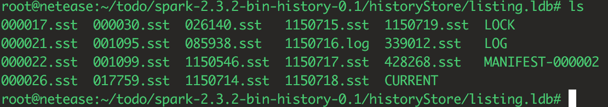

# LevelDB

leveldb是谷歌开源的一个kv数据库。spark history server在2.3版本中使用level db缓存application list，用来缓解spark history server的内存压力，以及支持更多数量的application。因此，借这个机会了解一下levelDB。

## Files

leveldb的实现类似于谷歌开源三驾马车之一的[bigtable](./bigtable.md). 但是文件组织的形式和bigtable有所不同。每个数据库的外在形式都是一堆文件。在leveldb中主要有下列文件。

### Log files

一个log file(*.log)存储最近的一连串更新操作，每次更新操作是append到当前的log file中，当这个log file达到预设的一个阈值(默认4MB)，它将被转换成一个sorted table，然后生成一个新的log file来记录将来的更新操作。

当前log file的一个副本被放置在内存里(memtable).在每次读操作时都会去访问这个内存中,这样就保证读的数据都是最新的，正确的数据。