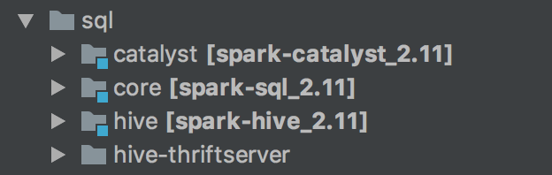

[Deep Dive into Spark SQL’s Catalyst Optimizer](https://databricks.com/blog/2015/04/13/deep-dive-into-spark-sqls-catalyst-optimizer.html)

## Spark Sql概述

spark sql是 apache spark的其中一个模块，主要用于进行结构化数据的处理。spark sql的底层执行还是调用rdd，在之前的文章中提过rdd的执行流程，因此本文主要讲解一下从sql到底层rdd的对接。通过观察spark sql 模块的源码，源码分为四个部分，如下图。




在官方github的sql模块readme文件有如下描述。

- Catalyst (sql/catalyst) - An implementation-agnostic framework for manipulating trees of relational operators and expressions.

- Execution (sql/core) - A query planner / execution engine for translating Catalyst's logical query plans into Spark RDDs. This component also includes a new public interface, SQLContext, that allows users to execute SQL or LINQ statements against existing RDDs and Parquet files.

- Hive Support (sql/hive) - Includes an extension of SQLContext called HiveContext that allows users to write queries using a subset of HiveQL and access data from a Hive Metastore using Hive SerDes. There are also wrappers that allow users to run queries that include Hive UDFs, UDAFs, and UDTFs.

- HiveServer and CLI support (sql/hive-thriftserver) - Includes support for the SQL CLI (bin/spark-sql) and a HiveServer2 (for JDBC/ODBC) compatible server.

本文主要讲解core和catalyst模块。首先给一个spark sql语句执行流程，来方便对后续内容进行整体把握。

1. SQL 语句经过 SqlParser 解析成 Unresolved LogicalPlan;
2. 使用 analyzer 结合数据数据字典 (catalog) 进行绑定, 生成 resolved LogicalPlan;
3. 使用 optimizer 对 resolved LogicalPlan 进行优化, 生成 optimized LogicalPlan;
4. 使用 SparkPlan 将 LogicalPlan 转换成 PhysicalPlan;
5. 使用 prepareForExecution() 将 PhysicalPlan 转换成可执行物理计划;
6. 使用 execute() 执行可执行物理计划;
7. 生成 RDD。

## 源码跟踪

首先是要创建sparkSession然后导入数据，此处不赘述。我们从执行sql语句开始跟踪。

```
val teenagersDF = spark.sql("SELECT SUM(v) FROM (SELECT score.id, 100+80+ score.math_score +score.english_score AS v FROM people JOIN score WHERE  people.id=score.id AND people.age >100) tmp")
```

### sql 语句-> Unresolved LogicalPlan


此部分主要是对sql语句进行解析。判断一条sql语句是否符合要求，并且进行各部分的划分，比如哪些是操作，哪些是得到的结果等等。


这样一句sql 调用，跟进去。

```
def sql(sqlText: String): DataFrame = {
  Dataset.ofRows(self, sessionState.sqlParser.parsePlan(sqlText))
}
```

我们可以看到sql语句会返回一个`dataFrame`。而在spark中DataFrame的定义就是`Dataset[Row]` .值得一提的是，在spark源码中用到了许多`lazy`变量，这些变量虽然是声明在类中，但是并不是在创建对象的时候就初始化这些变量，而是在第一次调用是才进行初始化，因此在跟踪源码时一定要注意这些lazy变量的调用，因为很多lazy变量的初始化都涉及到一系列函数的调用。如果不注意，会失去对很多函数的跟踪。具体lazy变量的介绍，[可以参考](https://stackoverflow.com/questions/7484928/what-does-a-lazy-val-do).

```
lazy val sqlParser: ParserInterface = new SparkSqlParser(conf)
```

可以看到sqlParser就是一个lazy变量，它会创建一个解析器。上述的sql函数在创建解析器之后调用parsePlan函数，如下。

```
/** Creates LogicalPlan for a given SQL string. */
override def parsePlan(sqlText: String): LogicalPlan = parse(sqlText) { parser =>
  astBuilder.visitSingleStatement(parser.singleStatement()) match {
    case plan: LogicalPlan => plan
    case _ =>
      val position = Origin(None, None)
      throw new ParseException(Option(sqlText), "Unsupported SQL statement", position, position)
  }
}
```

这个函数是使用了Scala柯里化特性。其实是调用的parse函数。

```
  protected def parse[T](command: String)(toResult: SqlBaseParser => T): T = {
    logInfo(s"Parsing command: $command")
    val lexer = new SqlBaseLexer(new ANTLRNoCaseStringStream(command))
    lexer.removeErrorListeners()
    lexer.addErrorListener(ParseErrorListener)
    val tokenStream = new CommonTokenStream(lexer)
    val parser = new SqlBaseParser(tokenStream)
    parser.addParseListener(PostProcessor)
    parser.removeErrorListeners()
    parser.addErrorListener(ParseErrorListener)

    try {
      try {
        // first, try parsing with potentially faster SLL mode
        parser.getInterpreter.setPredictionMode(PredictionMode.SLL)
        toResult(parser)
      }
      catch {
     ...
      }
    }
    catch {
      ...
    }
  }
}
```

而此处的parse函数是使用的Antlr(一个开源语法分析器)来对sql语句进行解析，lexer是其词法分析器，然后spark使用自身的sqlBaseParser对sql语句进行语法分析，结合parse和parsePlan函数，得到了sql语句的`UnresolvedLogicalPlan`.

### Resolved LogicalPlan

此部分是对之前得到的逻辑计划进行分析，比如这个字段到底应该是什么类型。


进入到Dataset类的ofRows函数。

```
def ofRows(sparkSession: SparkSession, logicalPlan: LogicalPlan): DataFrame = {
  val qe = sparkSession.sessionState.executePlan(logicalPlan)
  qe.assertAnalyzed()
  new Dataset[Row](sparkSession, qe, RowEncoder(qe.analyzed.schema))
}
```

这个函数很短，跟踪executePlan函数，可以看到它是创建了一个queryExecution对象。

```
def executePlan(plan: LogicalPlan): QueryExecution = new QueryExecution(sparkSession, plan)
```

这个对象是很重要的一个对象,涉及到前面的`UnresolvedLogicalPlan`的分析、优化、转物理计划以及ToRDD所有操作。


`org.apache.spark.sql.catalyst.analysisAnalyzer`是一个用于执行analysis的类，这个类继承RuleExecutor，其中定义了一系列的解析规则顺序执行来解析这些字段和函数等里面的属性。

```
 Batch("Substitution", fixedPoint,
      CTESubstitution,
      WindowsSubstitution,
      EliminateUnions,
      new SubstituteUnresolvedOrdinals(conf)),
    Batch("Resolution", fixedPoint,
      ResolveTableValuedFunctions ::
      ResolveRelations ::
      ResolveReferences ::
      ResolveCreateNamedStruct ::
      ResolveDeserializer ::
      ResolveNewInstance ::
      ResolveUpCast ::
      ResolveGroupingAnalytics ::
      ResolvePivot ::
      ResolveOrdinalInOrderByAndGroupBy ::
      ResolveMissingReferences ::
      ExtractGenerator ::
      ResolveGenerate ::
      ResolveFunctions ::
      ResolveAliases ::
      ResolveSubquery ::
      ResolveWindowOrder ::
      ResolveWindowFrame ::
      ResolveNaturalAndUsingJoin ::
      ExtractWindowExpressions ::
      GlobalAggregates ::
      ResolveAggregateFunctions ::
      TimeWindowing ::
      ResolveInlineTables ::
      TypeCoercion.typeCoercionRules ++
      extendedResolutionRules : _*),
    Batch("Nondeterministic", Once,
      PullOutNondeterministic),
    Batch("UDF", Once,
      HandleNullInputsForUDF),
    Batch("FixNullability", Once,
      FixNullability),
    Batch("Cleanup", fixedPoint,
      CleanupAliases)
```


Spark sql使用Catalyst规则和catalog来查询这些表是否存在，并来获得查询需要的具体属性。

- 向catalog查询relations(看ResolveRelation方法)
- 根据属性的名字做映射
- 对名字相同的attribute给unique id标注：例如前面sql语句的ta.key =  tb.key， 会被解析为 key#1L = key#8L
- 对expressions的类型做解析：例如` 1+2+ta.value`的类型是什么
- 如果有UDF，还要解析UDF
- 等等

得到`resolvedLogicalPlan`.

### OptimizedLogicalPlan

此部分主要是对逻辑计划进行优化， 例如谓词下推等等。


然后第三行，就是生成一个Dataset[Row]，前面提到过，其实这就是dataFrame。

跟踪进入Dataset的this函数。里面有一个变量会在创建对象时执行

```
@transient private[sql] val logicalPlan: LogicalPlan = {
  def hasSideEffects(plan: LogicalPlan): Boolean = plan match {
    case _: Command |
         _: InsertIntoTable => true
    case _ => false
  }

  queryExecution.analyzed match {
    // For various commands (like DDL) and queries with side effects, we force query execution
    // to happen right away to let these side effects take place eagerly.
    case p if hasSideEffects(p) =>
      LogicalRDD(queryExecution.analyzed.output, queryExecution.toRdd)(sparkSession)
    case Union(children) if children.forall(hasSideEffects) =>
      LogicalRDD(queryExecution.analyzed.output, queryExecution.toRdd)(sparkSession)
    case _ =>
      queryExecution.analyzed
  }
}
```

看到里面有一行调用了LogicalRDD函数，第一个参数是输出位置，第一个参数，queryExecution.toRdd. 一系列的lazy变量。

```
lazy val toRdd: RDD[InternalRow] = executedPlan.execute()
```

```
lazy val executedPlan: SparkPlan = prepareForExecution(sparkPlan)
```

```
lazy val sparkPlan: SparkPlan = {
  SparkSession.setActiveSession(sparkSession)
  // TODO: We use next(), i.e. take the first plan returned by the planner, here for now,
  //       but we will implement to choose the best plan.
  planner.plan(ReturnAnswer(optimizedPlan)).next()
}
```

```
lazy val optimizedPlan: LogicalPlan = sparkSession.sessionState.optimizer.execute(withCachedData)
```

这里调用了一些列，调用到optimizedPlan，其实也是进行规则优化，基于一系列规则，到不动点或者最大迭代次数退出优化。这就得到了`optimizedLogicalPlan`.

### PhysicalPlan

回到前面的sparkPlan懒变量，最后一句，planner.plan对之前的 `optimizedLogicalPlan`进行转化生成phsicalPlan。此处的next是操作是获得返回的physicalPlan迭代器中的第一个physicalPlan。

```
lazy val sparkPlan: SparkPlan = {
  SparkSession.setActiveSession(sparkSession)
  // TODO: We use next(), i.e. take the first plan returned by the planner, here for now,
  //       but we will implement to choose the best plan.
  planner.plan(ReturnAnswer(optimizedPlan)).next()
}
```

这里的planner为SparkPlanner，类中有一系列的策略，还可以从外部加策略。

```
def strategies: Seq[Strategy] =
    extraStrategies ++ (
    FileSourceStrategy ::
    DataSourceStrategy ::
    DDLStrategy ::
    SpecialLimits ::
    Aggregation ::
    JoinSelection ::
    InMemoryScans ::
    BasicOperators :: Nil)
```
然后进行转化的函数如下。

```
def plan(plan: LogicalPlan): Iterator[PhysicalPlan] = {
  // Obviously a lot to do here still...

  // Collect physical plan candidates.
  val candidates = strategies.iterator.flatMap(_(plan))

  // The candidates may contain placeholders marked as [[planLater]],
  // so try to replace them by their child plans.
  val plans = candidates.flatMap { candidate =>
    val placeholders = collectPlaceholders(candidate)

    if (placeholders.isEmpty) {
      // Take the candidate as is because it does not contain placeholders.
      Iterator(candidate)
    } else {
      // Plan the logical plan marked as [[planLater]] and replace the placeholders.
      placeholders.iterator.foldLeft(Iterator(candidate)) {
        case (candidatesWithPlaceholders, (placeholder, logicalPlan)) =>
          // Plan the logical plan for the placeholder.
          val childPlans = this.plan(logicalPlan)

          candidatesWithPlaceholders.flatMap { candidateWithPlaceholders =>
            childPlans.map { childPlan =>
              // Replace the placeholder by the child plan
              candidateWithPlaceholders.transformUp {
                case p if p == placeholder => childPlan
              }
            }
          }
      }
    }
  }

  val pruned = prunePlans(plans)
  assert(pruned.hasNext, s"No plan for $plan")
  pruned
}
```

没看明白，知识欠缺。大概就是得到一系列physicalPlan，然后进行剪枝，筛除掉性能不好的，这就得到了`physicalPlan`迭代器，然后通过前面说的next函数，得到迭代器头部的`physicalPlan`，应该是最好的那个。

###  可执行的物理计划

在得到物理计划sparkPlan之后会执行下面的函数，prepareForExecution(sparkPlan)，得到可执行的物理计划。

```
lazy val executedPlan: SparkPlan = prepareForExecution(sparkPlan)
```

```
/**
 * Prepares a planned [[SparkPlan]] for execution by inserting shuffle operations and internal
 * row format conversions as needed.
 */
protected def prepareForExecution(plan: SparkPlan): SparkPlan = {
  preparations.foldLeft(plan) { case (sp, rule) => rule.apply(sp) }
}

/** A sequence of rules that will be applied in order to the physical plan before execution. */
protected def preparations: Seq[Rule[SparkPlan]] = Seq(
  python.ExtractPythonUDFs,
  PlanSubqueries(sparkSession),
  EnsureRequirements(sparkSession.sessionState.conf),
  CollapseCodegenStages(sparkSession.sessionState.conf),
  ReuseExchange(sparkSession.sessionState.conf),
  ReuseSubquery(sparkSession.sessionState.conf))
```

看源码这里，perpare分为六部分，第一部分是抽取出python的UDF来优化，由于对python不了解，所以此处不讲。第二部分是对子查询进行递归操作。第三部分是ensureRequirement，这部分是给执行计划添加exchange(相当于shuffle)以及排序。第四部分是codegen，这是在类wholeStageCodegen中完成，这里应该是在针对整个stage的代码进行优化，看源码是给一个模板， 然后将相应部分套到这么源码模板里面，最后生成优化代码。最后两部分是对之后相同的操作进行重复使用前面的结果。

### 执行 

可以看到在获得获得可执行计划之后就是执行，

```
lazy val toRdd: RDD[InternalRow] = executedPlan.execute()
```


```
final def execute(): RDD[InternalRow] = executeQuery {
  doExecute()
}
```

```
//class sparkPlan
protected def doExecute(): RDD[InternalRow]
```

这个函数对应很多子类，每个子类的第一句基本都是`child.execute()`,可见这是在构建lineage。也就是一条链，把所有可执行计划串联起来。

这里的doExecute返回的是一个中间类型的RDD。


