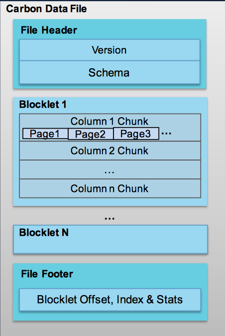
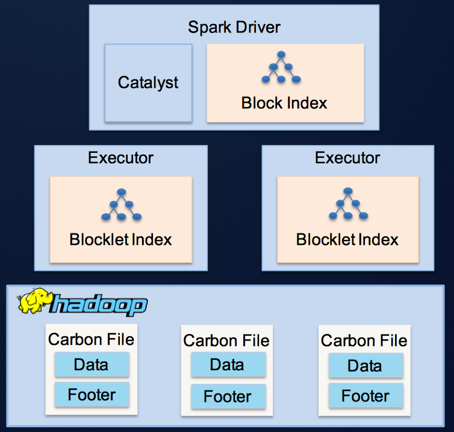
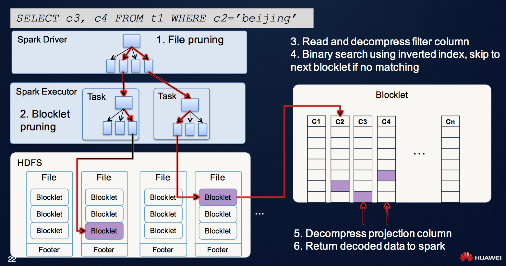
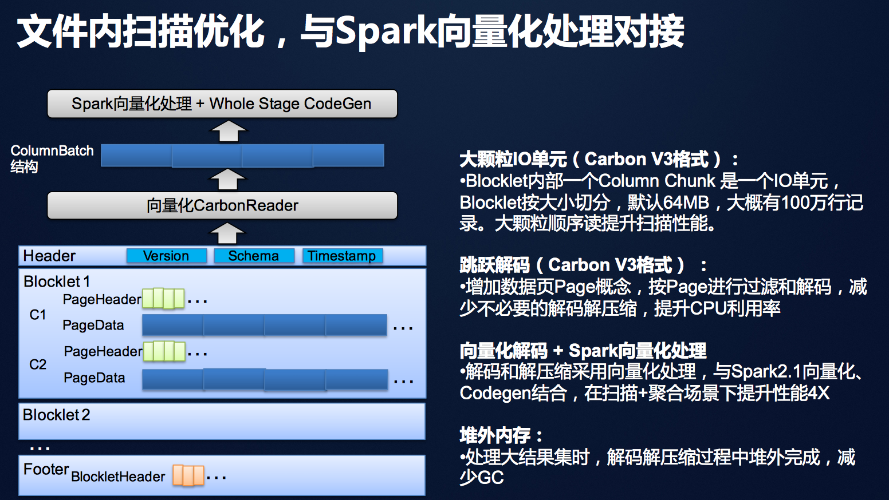
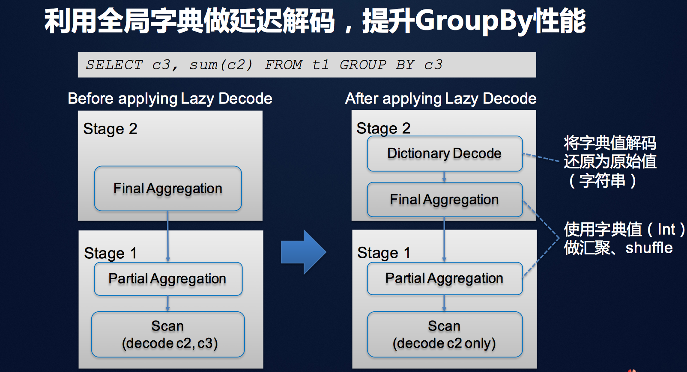
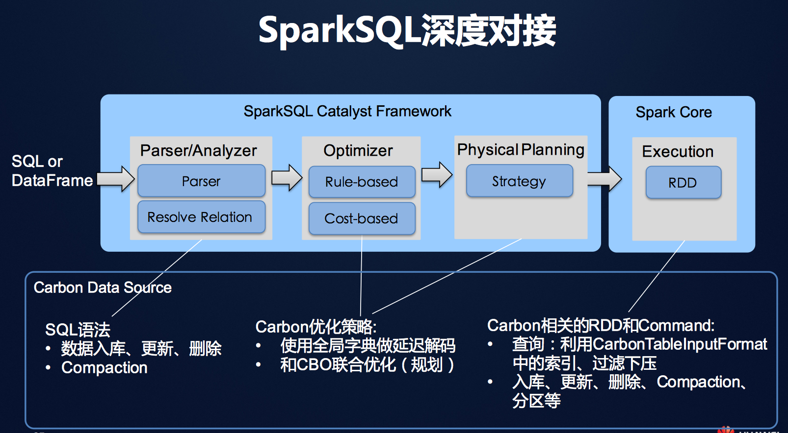

# CarbonData

## What is CarbonData?

Apache CarbonData是由华为开源的，一个按列索引的数据格式，用于大数据平台的快速数据分析，适用的大数据平台包括 Apache Hadoop, Apache Spark, Apache Flink.

Carbondata是存储在HDFS的列式存储数据格式，它具有列式存储具有的特性，例如分割，压缩，复杂数据结构支持，CarbonData的特性如下。

- 存储数据的同时持有索引：当查询存在过滤条件时，可以显著的加速查询性能和减少I/O扫描和CPU资源。后面细说。
- 可操作编码数据：支持高效的压缩及全局解码，可直接操作压缩/编码数据。
- 一种数据格式支持多种用户场景：例如OLAP查询，顺序访问和随机访问。

## Why need CarbonData?

目前是一个数据爆发的时代，每天产生大量的数据，需要从数据中挖掘出价值。

数据处理的场景有很多，比如生成报告，OLAP(联机分析处理)，批处理，机器学习，实时分析等等。

这些数据带来价值的同时也带来了很多挑战。

- 数据量大。 单个表的大小可能有百亿条数据，并且数据在快速的增长。

- 多维度。 每条数据可能超过100维。

- 细粒度。 每条数据包含大量的细节数据，进行处理时复杂度高。

同时数据处理应用也带来一些挑战。

- 数据处理需要应用集成。比如需要SQL 查询，也需要BI等等集成多种功能。

- 查询灵活。 数据的任何维度都可能发生计算关联。可能全扫描也可能小范围扫描。精准查询或者模糊查询。等等。

那面对这些数据特点和处理要求，该如何选择数据存储方式呢？

- NoSQL Database。 只能通过key访问，一键一值。适合实时应用对接，不适合分析型应用。
- Parallel database。 细粒度控制并行计算，适合中小规模数据分析。但是扩展能力有上限，查询内容错能力弱，不适合海量数据分析。
- 搜索引擎(Apache Solr)。适合多条件过滤和文本分析，但是无法完成复杂计算，而且数据膨胀厉害，迁移麻烦。
- Sql on Hadoop。并行扫描并行计算，适合海量数据计算，但是仍然使用为批处理设计的存储，场景首先。

那么设计师改如何选择，来处理多种应用呢？

是作出妥协，只满足部分应用的处理要求，还是讲数据复制多分，满足所有应用呢？

而CarbonData的设计目标就是一份数据满足多种业务需求，这样就可以避免数据的多分复制，一份数据满足多种分析场景：详单过滤，海量数仓，数据集市。

## CabonData 设计

### 数据组织

carbonData中的数据组织如下图所示。

- 数据布局

		•Block：一个HDFS文件，256MB

		•Blocklet：文件内的列存数据块，是最小的IO读取单元
		
		•Column chunk: Blocklet内的列数据
		
		•Page：Column chunk内的数据页，是最小的解码单元

- 元数据信息

		•Header：Version，Schema

		•Footer： Blocklet Offset, Index & 文件级统计信息

- 内置索引和统计信息

		•Blocklet索引：B Tree startkey, endkey

		•Blocklet级和Page级统计信息：min，max等

### 索引

CarbonData利用两级索引架构减少Spark Task数和磁盘IO。

- 第一级：文件级索引 用于过滤文件（HDFS Block）， 避免扫描不必要的文件，减少多 达95%的Spark Task

- 第二级：Blocklet索引 用于过滤文件内部的Blocklet， 避免扫描不必要的Blocklet，减 少磁盘IO

### 扫描过程

### 总结
- 查询：

• 两级索引，减少IO：适合ad-hoc查询，任意维度组合查询场景

• 延迟解码，向量化处理：适合全表扫描、汇总分析场景

- 数据管理：

• 增量入库，多级排序可调：由用户权衡入库时间和查询性能

• 增量更新，批量合并：支持快速更新事实表或维表，闲时做Compaction合并

- 大规模： 
• 计算与存储分离：支持从GB到PB大规模数据，万亿数据秒级响应
- 部署：
• Hadoop Native格式：与大数据生态无缝集成，利用已有Hadoop集群资产

## CarbonData  and Parquet

1、周边工具的完善度。Parquet对于thrift，protobuf都支持，但是CarbonData目前好像就支持thrift。

2、 CarbonData有着更丰富的索引及编码支持。包括B+ Tree索引（B+ Tree Index）、倒排索引（Inverted Index）、全局词典编码（Global Dictionary Encoding）等。在数据加载方面CarbonData会比Parquet慢，但是查询会快。CarbonData的文件也会比Parquet大，以空间换取时间。

3、对hadoop相关生态支持比较好。CarbonData首先做了与spark的高度集成，其中基于SparkSQL框架增强了过滤下压、延迟物化、增量入库等特性。

TODO: 性能测试。

## References

[carbon data官网](http://carbondata.apache.org/)

[关于CarbonData+Spark SQL的一些应用实践和调优经验分享](http://www.infoq.com/cn/news/2017/09/CarbonData-Spark-huawei)

