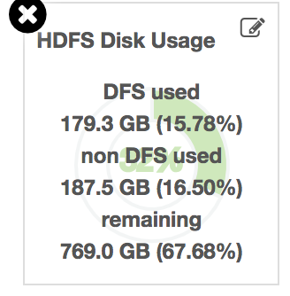
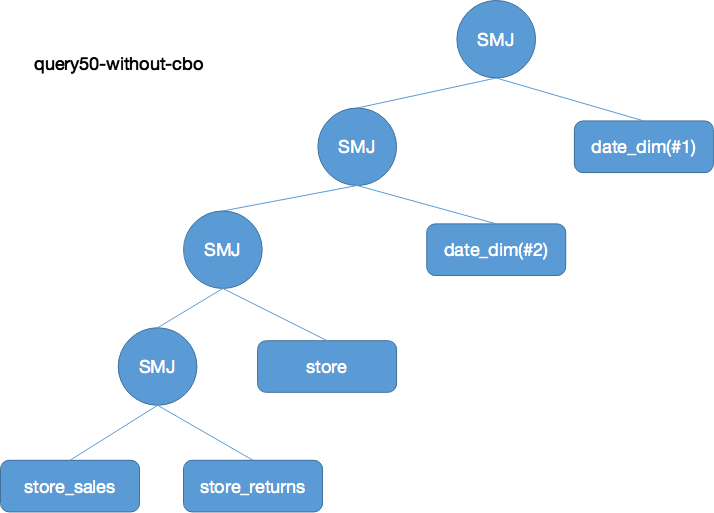
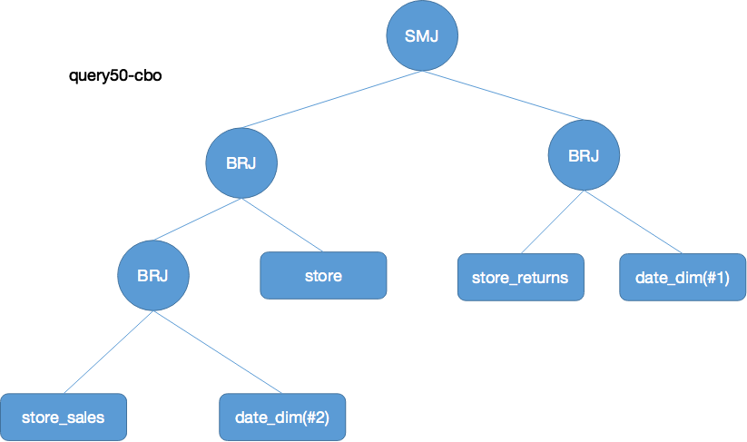

## Spark SQL CBO TPCDS测试

### 测试环境

测试使用工具为 tpcds, https://github.com/yaooqinn/tpcds-for-spark

六个节点，每个节点16g内存，四核，2.4GHZ

测试使用数据为100G.

Spark版本为官方包2.3.1,下载地址：http://mirrors.hust.edu.cn/apache/spark/spark-2.3.1/spark-2.3.1-bin-hadoop2.7.tgz

集群存储空间使用如下，HDFS的replication设置为1.



### 参数配置

通用参数配置如下：

```java
spark.master    yarn
spark.submit.deployMode   client
spark.serializer                                      org.apache.spark.serializer.KryoSerializer
spark.kryoserializer.buffer.max                       256m
# sql setting
spark.sql.shuffle.partitions   1024
spark.sql.crossJoin.enabled   true
spark.sql.autoBroadcastJoinThreshold          204857600
# executor setting
spark.executor.cores         2
spark.executor.memory  8g
spark.executor.instances      6
spark.executor.memoryOverhead     2048
spark.executor.extraJavaOptions  -XX:PermSize=1024m -XX:MaxPermSize=1024m -verbose:gc -XX:+PrintGCDetails -XX:+PrintGCDateStamps -XX:+PrintTenuringDistribution
## Dynamic Allocation Settings ##
spark.shuffle.service.enabled                         true
spark.dynamicAllocation.enabled                       false
spark.dynamicAllocation.initialExecutors              1
spark.dynamicAllocation.minExecutors                  1
spark.dynamicAllocation.maxExecutors                  20
## Driver/AM Settings ##
spark.yarn.am.cores                                   2
spark.yarn.am.memory                                  2g
spark.yarn.am.memoryOverhead                          512
spark.yarn.am.extraJavaOptions                        -XX:PermSize=1024m -XX:MaxPermSize=2048m -verbose:gc -XX:+PrintGCDetails -XX:+PrintGCDateStamps -XX:+PrintTenuringDistribution
spark.driver.maxResultSize                            2g
spark.driver.memory                                   8g
spark.driver.extraJavaOptions                         -XX:PermSize=1024m -XX:MaxPermSize=1024m
## Hadoop Settings ##
spark.hadoop.fs.hdfs.impl.disable.cache               true
spark.hadoop.fs.file.impl.disable.cache               true
spark.driver.maxResultSize     4g
```

测试分为两组，一组是开了CBO的，一组是对照组没开启CBO参数。

CBO参数设置如下:

```
spark.sql.cbo.enabled=true 
spark.sql.cbo.joinReorder.dp.star.filter=true spark.sql.cbo.joinReorder.dp.threshold=12
spark.sql.cbo.joinReorder.enabled=true
spark.sql.cbo.starSchemaDetection=true

```

### CBO相关操作

tpcds 生成的数据在创建表之后，生成48张表。

CBO依赖一些统计数据来用于评估优化，因此需要使用命令来获得统计信息。如果不统计，会影响CBO的效果，因为我之前没有使用analyze table命令，在对比实验组和对照组的explain时发现无变化。

统计信息分为两种，一种是基本的表信息，另外一种是表中的列信息。

```SQL
# 统计表的条数以及大小信息
ANALYZE TABLE table_name COMPUTE STATISTICS
# 统计表中列数据的详细信息，最大值，最小值，平均长度，最大长度，为空数量等
ANALYZE TABLE table_name COMPUTE STATISTICS FOR COLUMNS column-name1, column-name2, ….
```

本次实验，对于CBO对照组，使用analyze table命令得到48张表所有列的统计信息。

共花费时间59min。


### 实验结果


结论：

这些sql，不使用CBO花费42883s，使用CBO花费23241s，加上analyze table使用的3600s，大概27000s，整体提升37%。

各个sql语句性能提升的百分比如下图:

灰色和黑色代表CBO的性能相对下降，绿色代表性能有提升，红色代表性能提升巨大。

可以看出大部分都是性能提升，只有几个sql出现了性能下降。


### 结果分析

在性能提升的一组，选取query11，观察这条query在cbo优化前后的explain变化。

query11的[详细physical plan在这.](./spark-cbo-explain.md/#EXPLAIN11)

query11优化前后的简要示意图如下所示：


在CBO开启之后，首先是进行`costBasedReorderJoin`,然后是进行`JoinSelection`.

在基于costBasedReorderJoin 这里，在进行代价评估之后，根据DP算法，将join的顺序进行更改，可以看到cbo优化之后，join顺序的改变，date_dim放在前面进行join相对customer放在前面join，有性能提升。这是因为date_dim过滤之后数据量更小。

然后是进行JoinSelection。

图中比较明显，有几个在CBO开启之前的sortMergeJoin换成了broadcasthashJoin，，性能提升很大。这是由于`data_dim`这个表在进行filter下推之后，经过filter只有很少的数据，但是在没有开启CBO，不能得到columnStatistics信息，就不能比较准确的评估这个表的size。

虽然判断broadcast在是否开启CBO都会进行判断，然而broadcast目前是基于表的size来判断的，这就关乎cbo开启之前和之后的Statistics准确度问题。

在[spark cbo源码分析](./spark-cbo-code-analysis.md)里面讲过，如果没有开启CBO，如果join类型不是leftSemi或者leftAnti join，则将两表大小之乘积作为预估大小，且在整条plan tree的估计都是粗糙的，会放大误差，造成这里预估的值大于 阈值，从而采取了不合适的join方法。


**性能下降这里选取query50作为例子**

query50出现了性能下降。

query50在开启cbo之前的join树如图:



在CBO开启之后，join结构如下:



可以看出，join顺序发生了变化，且出现了部分的broadcastJoin取代了sortmergeJoin，那么为什么会造成性能下降呢？

我们打印了query50CBO开启时的统计信息，如下：

```bash
== Optimized Logical Plan ==
GlobalLimit 100, Statistics(sizeInBytes=22.7 KB, rowCount=100, hints=none)
+- LocalLimit 100, Statistics(sizeInBytes=2.31E+31 B, hints=none)
   +- Sort [s_store_name#55 ASC NULLS FIRST, s_company_id#66 ASC NULLS FIRST, s_street_number#68 ASC NULLS FIRST, s_street_name#69 ASC NULLS FIRST, s_street_type#70 ASC NULLS FIRST, s_suite_number#71 ASC NULLS FIRST, s_city#72 ASC NULLS FIRST, s_county#73 ASC NULLS FIRST, s_state#74 ASC NULLS FIRST, s_zip#75 ASC NULLS FIRST], true, Statistics(sizeInBytes=2.31E+31 B, hints=none)
      +- Aggregate [s_store_name#55, s_company_id#66, s_street_number#68, s_street_name#69, s_street_type#70, s_suite_number#71, s_city#72, s_county#73, s_state#74, s_zip#75], [s_store_name#55, s_company_id#66, s_street_number#68, s_street_name#69, s_street_type#70, s_suite_number#71, s_city#72, s_county#73, s_state#74, s_zip#75, sum(cast(CASE WHEN ((sr_returned_date_sk#49L - ss_sold_date_sk#29L) <= 30) THEN 1 ELSE 0 END as bigint)) AS 30days#2L, sum(cast(CASE WHEN (((sr_returned_date_sk#49L - ss_sold_date_sk#29L) > 30) && ((sr_returned_date_sk#49L - ss_sold_date_sk#29L) <= 60)) THEN 1 ELSE 0 END as bigint)) AS 3160days#3L, sum(cast(CASE WHEN (((sr_returned_date_sk#49L - ss_sold_date_sk#29L) > 60) && ((sr_returned_date_sk#49L - ss_sold_date_sk#29L) <= 90)) THEN 1 ELSE 0 END as bigint)) AS 6190days#4L, sum(cast(CASE WHEN (((sr_returned_date_sk#49L - ss_sold_date_sk#29L) > 90) && ((sr_returned_date_sk#49L - ss_sold_date_sk#29L) <= 120)) THEN 1 ELSE 0 END as bigint)) AS 91120days#5L, sum(cast(CASE WHEN ((sr_returned_date_sk#49L - ss_sold_date_sk#29L) > 120) THEN 1 ELSE 0 END as bigint)) AS dy120days#6L], Statistics(sizeInBytes=2.31E+31 B, hints=none)
         +- Project [ss_sold_date_sk#29L, sr_returned_date_sk#49L, s_store_name#55, s_company_id#66, s_street_number#68, s_street_name#69, s_street_type#70, s_suite_number#71, s_city#72, s_county#73, s_state#74, s_zip#75], Statistics(sizeInBytes=2.07E+31 B, hints=none)
            +- Join Inner, (((ss_item_sk#8L = sr_item_sk#31L) && (ss_customer_sk#9L = sr_customer_sk#32L)) && (ss_ticket_number#15L = sr_ticket_number#38L)), Statistics(sizeInBytes=2.55E+31 B, hints=none)
               :- Project [ss_item_sk#8L, ss_customer_sk#9L, ss_ticket_number#15L, ss_sold_date_sk#29L, s_store_name#55, s_company_id#66, s_street_number#68, s_street_name#69, s_street_type#70, s_suite_number#71, s_city#72, s_county#73, s_state#74, s_zip#75], Statistics(sizeInBytes=165.2 EB, hints=none)
               :  +- Join Inner, (ss_store_sk#13L = s_store_sk#50L), Statistics(sizeInBytes=177.0 EB, hints=none)
               :     :- Project [ss_item_sk#8L, ss_customer_sk#9L, ss_store_sk#13L, ss_ticket_number#15L, ss_sold_date_sk#29L], Statistics(sizeInBytes=2.4 PB, hints=none)
               :     :  +- Join Inner, (ss_sold_date_sk#29L = d_date_sk#79L), Statistics(sizeInBytes=2.8 PB, hints=none)
               :     :     :- Project [ss_item_sk#8L, ss_customer_sk#9L, ss_store_sk#13L, ss_ticket_number#15L, ss_sold_date_sk#29L], Statistics(sizeInBytes=2.5 GB, hints=none)
               :     :     :  +- Filter ((((isnotnull(ss_item_sk#8L) && isnotnull(ss_customer_sk#9L)) && isnotnull(ss_ticket_number#15L)) && isnotnull(ss_store_sk#13L)) && isnotnull(ss_sold_date_sk#29L)), Statistics(sizeInBytes=9.8 GB, hints=none)
               :     :     :     +- Relation[ss_sold_time_sk#7L,ss_item_sk#8L,ss_customer_sk#9L,ss_cdemo_sk#10L,ss_hdemo_sk#11L,ss_addr_sk#12L,ss_store_sk#13L,ss_promo_sk#14L,ss_ticket_number#15L,ss_quantity#16,ss_wholesale_cost#17,ss_list_price#18,ss_sales_price#19,ss_ext_discount_amt#20,ss_ext_sales_price#21,ss_ext_wholesale_cost#22,ss_ext_list_price#23,ss_ext_tax#24,ss_coupon_amt#25,ss_net_paid#26,ss_net_paid_inc_tax#27,ss_net_profit#28,ss_sold_date_sk#29L] parquet, Statistics(sizeInBytes=9.8 GB, hints=none)
               :     :     +- Project [d_date_sk#79L], Statistics(sizeInBytes=1141.4 KB, rowCount=7.30E+4, hints=none)
               :     :        +- Filter isnotnull(d_date_sk#79L), Statistics(sizeInBytes=22.9 MB, rowCount=7.30E+4, hints=none)
               :     :           +- Relation[d_date_sk#79L,d_date_id#80,d_date#81,d_month_seq#82L,d_week_seq#83L,d_quarter_seq#84L,d_year#85L,d_dow#86L,d_moy#87L,d_dom#88L,d_qoy#89L,d_fy_year#90L,d_fy_quarter_seq#91L,d_fy_week_seq#92L,d_day_name#93,d_quarter_name#94,d_holiday#95,d_weekend#96,d_following_holiday#97,d_first_dom#98L,d_last_dom#99L,d_same_day_ly#100L,d_same_day_lq#101L,d_current_day#102,... 4 more fields] parquet, Statistics(sizeInBytes=22.9 MB, rowCount=7.30E+4, hints=none)
               :     +- Project [s_store_sk#50L, s_store_name#55, s_company_id#66, s_street_number#68, s_street_name#69, s_street_type#70, s_suite_number#71, s_city#72, s_county#73, s_state#74, s_zip#75], Statistics(sizeInBytes=74.2 KB, rowCount=402, hints=none)
               :        +- Filter isnotnull(s_store_sk#50L), Statistics(sizeInBytes=205.7 KB, rowCount=402, hints=none)
               :           +- Relation[s_store_sk#50L,s_store_id#51,s_rec_start_date#52,s_rec_end_date#53,s_closed_date_sk#54L,s_store_name#55,s_number_employees#56,s_floor_space#57,s_hours#58,s_manager#59,s_market_id#60,s_geography_class#61,s_market_desc#62,s_market_manager#63,s_division_id#64,s_division_name#65,s_company_id#66,s_company_name#67,s_street_number#68,s_street_name#69,s_street_type#70,s_suite_number#71,s_city#72,s_county#73,... 5 more fields] parquet, Statistics(sizeInBytes=205.7 KB, rowCount=402, hints=none)
               +- Project [sr_item_sk#31L, sr_customer_sk#32L, sr_ticket_number#38L, sr_returned_date_sk#49L], Statistics(sizeInBytes=124.7 GB, hints=none)
                  +- Join Inner, (sr_returned_date_sk#49L = d_date_sk#107L), Statistics(sizeInBytes=149.7 GB, hints=none)
                     :- Project [d_date_sk#107L], Statistics(sizeInBytes=496.0 B, rowCount=31, hints=none)
                     :  +- Filter ((((isnotnull(d_year#113L) && isnotnull(d_moy#115L)) && (d_year#113L = 2000)) && (d_moy#115L = 9)) && isnotnull(d_date_sk#107L)), Statistics(sizeInBytes=9.9 KB, rowCount=31, hints=none)
                     :     +- Relation[d_date_sk#107L,d_date_id#108,d_date#109,d_month_seq#110L,d_week_seq#111L,d_quarter_seq#112L,d_year#113L,d_dow#114L,d_moy#115L,d_dom#116L,d_qoy#117L,d_fy_year#118L,d_fy_quarter_seq#119L,d_fy_week_seq#120L,d_day_name#121,d_quarter_name#122,d_holiday#123,d_weekend#124,d_following_holiday#125,d_first_dom#126L,d_last_dom#127L,d_same_day_ly#128L,d_same_day_lq#129L,d_current_day#130,... 4 more fields] parquet, Statistics(sizeInBytes=22.9 MB, rowCount=7.30E+4, hints=none)
                     +- Project [sr_item_sk#31L, sr_customer_sk#32L, sr_ticket_number#38L, sr_returned_date_sk#49L], Statistics(sizeInBytes=309.0 MB, hints=none)
                        +- Filter (((isnotnull(sr_item_sk#31L) && isnotnull(sr_customer_sk#32L)) && isnotnull(sr_ticket_number#38L)) && isnotnull(sr_returned_date_sk#49L)), Statistics(sizeInBytes=1297.9 MB, hints=none)
                           +- Relation[sr_return_time_sk#30L,sr_item_sk#31L,sr_customer_sk#32L,sr_cdemo_sk#33L,sr_hdemo_sk#34L,sr_addr_sk#35L,sr_store_sk#36L,sr_reason_sk#37L,sr_ticket_number#38L,sr_return_quantity#39L,sr_return_amt#40,sr_return_tax#41,sr_return_amt_inc_tax#42,sr_fee#43,sr_return_ship_cost#44,sr_refunded_cash#45,sr_reversed_charge#46,sr_store_credit#47,sr_net_loss#48,sr_returned_date_sk#49L] parquet, Statistics(sizeInBytes=1297.9 MB, hints=none)


```

可以看出这里，有几个统计的size是EB级别，例如：

```
               :  +- Join Inner, (ss_store_sk#13L = s_store_sk#50L), Statistics(sizeInBytes=177.0 EB, hints=none)

```

查了一下1EB=1024PB，这属于统计信息严重失真，因此造成了最后的性能下降，可见cbo也会发生统计信息严重不准确的情况，不过纵观整体查询大部分还是有优化，性能下降的查询较少。

对于统计信息严重不准确的情况，后续需要详细分析。