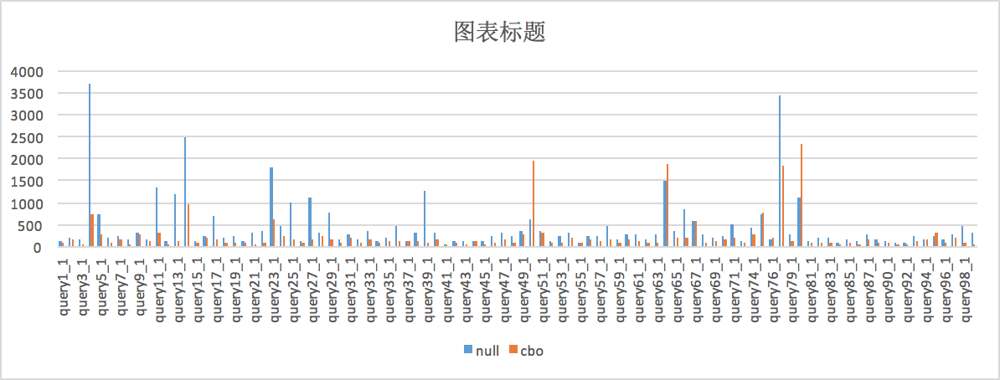
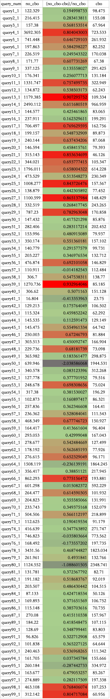
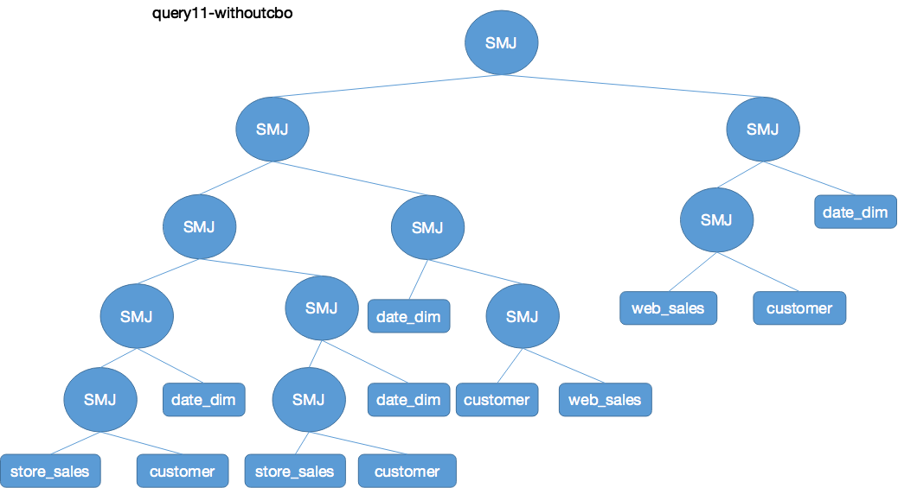
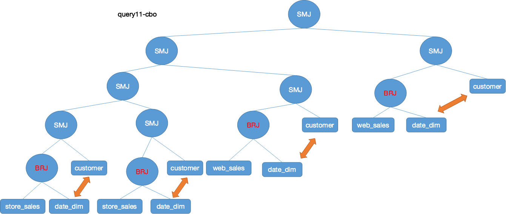

## Spark SQL CBO TPCDS测试

### 测试环境

测试使用工具为 tpcds, https://github.com/yaooqinn/tpcds-for-spark

六个节点，每个节点16g内存，四核，2.4GHZ

测试使用数据为100G.

Spark版本为官方包2.3.1,下载地址：http://mirrors.hust.edu.cn/apache/spark/spark-2.3.1/spark-2.3.1-bin-hadoop2.7.tgz

集群存储空间使用如下，HDFS的replication设置为1.


### 参数配置

通用参数配置如下：

```java
spark.master    yarn
spark.submit.deployMode   client
spark.serializer                                      org.apache.spark.serializer.KryoSerializer
spark.kryoserializer.buffer.max                       256m
# sql setting
spark.sql.shuffle.partitions   1024
spark.sql.crossJoin.enabled   true
spark.sql.autoBroadcastJoinThreshold          204857600
# executor setting
spark.executor.cores         2
spark.executor.memory  8g
spark.executor.instances      6
spark.executor.memoryOverhead     2048
spark.executor.extraJavaOptions  -XX:PermSize=1024m -XX:MaxPermSize=1024m -verbose:gc -XX:+PrintGCDetails -XX:+PrintGCDateStamps -XX:+PrintTenuringDistribution
## Dynamic Allocation Settings ##
spark.shuffle.service.enabled                         true
spark.dynamicAllocation.enabled                       false
spark.dynamicAllocation.initialExecutors              1
spark.dynamicAllocation.minExecutors                  1
spark.dynamicAllocation.maxExecutors                  20
## Driver/AM Settings ##
spark.yarn.am.cores                                   2
spark.yarn.am.memory                                  2g
spark.yarn.am.memoryOverhead                          512
spark.yarn.am.extraJavaOptions                        -XX:PermSize=1024m -XX:MaxPermSize=2048m -verbose:gc -XX:+PrintGCDetails -XX:+PrintGCDateStamps -XX:+PrintTenuringDistribution
spark.driver.maxResultSize                            2g
spark.driver.memory                                   8g
spark.driver.extraJavaOptions                         -XX:PermSize=1024m -XX:MaxPermSize=1024m
## Hadoop Settings ##
spark.hadoop.fs.hdfs.impl.disable.cache               true
spark.hadoop.fs.file.impl.disable.cache               true
spark.driver.maxResultSize     4g
```

测试分为两组，一组是开了CBO的，一组是对照组没开启CBO参数。

CBO参数设置如下:

```
spark.sql.cbo.enabled=true 
spark.sql.cbo.joinReorder.dp.star.filter=true spark.sql.cbo.joinReorder.dp.threshold=12
spark.sql.cbo.joinReorder.enabled=true
spark.sql.cbo.starSchemaDetection=true

```

### CBO相关操作

tpcds 生成的数据在创建表之后，生成48张表。

CBO依赖一些统计数据来用于评估优化，因此需要使用命令来获得统计信息。如果不统计，会影响CBO的效果，因为我之前没有使用analyze table命令，在对比实验组和对照组的explain时发现无变化。

统计信息分为两种，一种是基本的表信息，另外一种是表中的列信息。

```SQL
# 统计表的条数以及大小信息
ANALYZE TABLE table_name COMPUTE STATISTICS
# 统计表中列数据的详细信息，最大值，最小值，平均长度，最大长度，为空数量等
ANALYZE TABLE table_name COMPUTE STATISTICS FOR COLUMNS column-name1, column-name2, ….
```

本次实验，对于CBO对照组，使用analyze table命令得到48张表所有列的统计信息。

共花费时间59min。


### 实验结果



结论：

这些sql，不使用CBO花费42883s，使用CBO花费23241s，加上analyze table使用的3600s，大概27000s，整体提升37%。

各个sql语句性能提升的百分比如下图:

灰色和黑色代表CBO的性能相对下降，绿色代表性能有提升，红色代表性能提升巨大。

可以看出大部分都是性能提升，只有几个sql出现了性能下降。



### 结果分析

在性能提升的一组，选取query11，观察这条query在cbo优化前后的explain变化。

query11的[详细physical plan在这.](./spark-cbo-explain.md/#EXPLAIN11)

query11优化前后的简要示意图如下所示：






首先比较明显的就是，在cbo之后，使用broadcast join代替了cbo之前的sortMergejoin，性能提升很大。

这就关乎cbo开启之前和之后的Statistics准确度问题。

在`spark cbo源码分析`里面讲过，如果没有开启CBO，如果join类型不是leftSemi或者leftAnti join，则将两表大小之乘积作为预估大小，且在整条plan tree的估计都是粗糙的，会放大误差，造成这里预估的值大于 阈值，从而采取了不合适的join方法。


##  11和25要画图对照