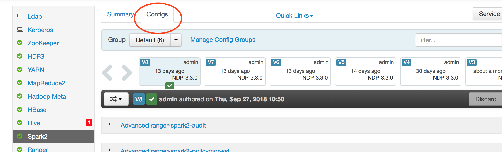
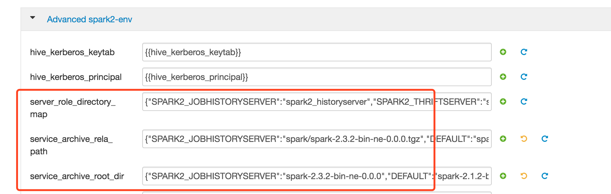
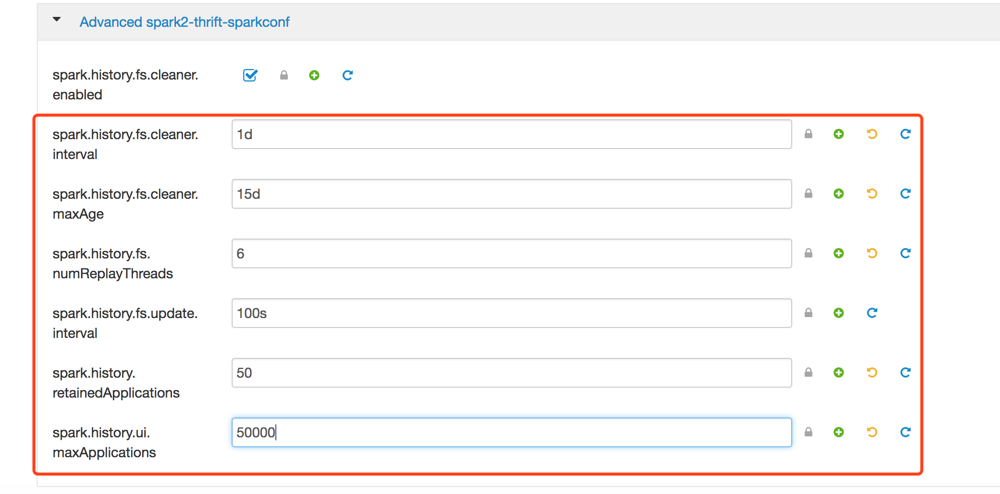

# Spark History Server升级文档

目前线上的spark history server 只能提供少量的application日志。

最近测试了新版本的spark history server，在线上试运行近半个月，运行稳定，可以查看的application 日志数量更多，重启速度更快。

安装包地址为：http://repo.bdms.netease.com/dev_packages/common/spark/spark-2.3.2-bin-his-0.1.tgz

## 手动升级

将安装包解压，在conf/spark-env.sh中配置。

spark-env.sh中所有配置选项都可从老版本history server配置文件拷贝，注意调大SPARK_DAEMON_MEMORY至40G。

```
# JVM内存设置40G，可按需调大
export SPARK_DAEMON_MEMORY=40960m
# kerboers配置项为/home/hadoop/krb5/krb5.conf 
export SPARK_DAEMON_JAVA_OPTS="-server -XX:+UseParNewGC  -XX:ParallelGCThreads=30  -XX:MaxTenuringThreshold=10  -XX:TargetSurvivorRatio=70  -XX:+UseConcMarkSweepGC -XX:+CMSPermGenSweepingEnabled   -XX:+CMSConcurrentMTEnabled  -XX:ParallelCMSThreads=30  -XX:+UseCMSInitiatingOccupancyOnly  -XX:+CMSClassUnloadingEnabled  -XX:+DisableExplicitGC  -XX:CMSInitiatingOccupancyFraction=70  -XX:+CMSParallelRemarkEnabled  -XX:SoftRefLRUPolicyMSPerMB=0 -XX:+UseCMSCompactAtFullCollection  -XX:CMSFullGCsBeforeCompaction=1  -verbose:gc  -XX:+PrintGCDetails  -XX:+PrintGCDateStamps  -XX:GCLogFileSize=512M  -Xloggc:/home/hadoop/logs/gc-sparkhs.log -Djava.security.krb5.conf=/home/hadoop/krb5/krb5.conf ${SPARK_DAEMON_JAVA_OPTS}"
export JAVA_HOME=/usr/jdk64/jdk1.8.0_77
export HADOOP_HOME=${HADOOP_HOME:-/usr/ndp/current/mapreduce_client}
export HADOOP_CONF_DIR=/home/hadoop/hadoop_conf
export LD_LIBRARY_PATH=/usr/ndp/current/mapreduce_client/lib/native:/usr/ndp/current/mapreduce_client/lib/native/Linux-amd64-64:$LD_LIBRARY_PATH

```

spark-default.conf配置如下：

需要额外添加的配置项为`spark.history.store.path` `spark.history.store.maxDiskUsage`  ,spark.history.store.path 需要手动创建目录，spark.history.store.maxDiskUsage 设为20g。

其他所有配置都可从老版本history server中拷贝，然后`spark.history.fs.cleaner.maxAge`调大至15d，`spark.history.ui.maxApplications`调大至50000(后续如果spark每天的应用数更多，可以调至100000),另外`spark.history.fs.numReplayThreads`设置为6(重要)。

参考如下：

```
spark.driver.extraLibraryPath /usr/ndp/current/mapreduce_client/lib/native:/usr/ndp/current/mapreduce_client/lib/native/Linux-amd64-64
# 配置日志目录
spark.eventLog.dir hdfs://hz-cluster3/user/spark/history
spark.eventLog.enabled true
spark.executor.extraLibraryPath /usr/ndp/current/mapreduce_client/lib/native:/usr/ndp/current/mapreduce_client/lib/native/Linux-amd64-64
spark.history.fs.cleaner.interval 1d
# 设置为保存15天日志
spark.history.fs.cleaner.maxAge 15d
# 按集群情况更改
spark.history.fs.logDirectory hdfs://hz-cluster3/user/spark/history
# 推荐设置为机器核数的25%，若太高，会造成第一次启动时，网络流量过大
spark.history.fs.numReplayThreads 6
spark.history.fs.update.interval 100s
spark.history.kerberos.enabled true
# 需更改
spark.history.kerberos.principal                      hadoop/admin@HADOOP.HZ.NETEASE.COM
# 需更改
spark.history.kerberos.keytab                         /home/hadoop/yarn/conf/hadoop.keytab
spark.history.provider org.apache.spark.deploy.history.FsHistoryProvider
spark.history.retainedApplications 50
spark.history.ui.maxApplications 50000
spark.history.ui.port 18080
spark.yarn.historyServer.address spark1.lt.163.org:18080
spark.yarn.queue default
# 必须设置
spark.history.store.path     /home/hadoop/spark-2.3.2-bin-his-0.1/historyStore
spark.history.store.maxDiskUsage   20g
```

然后关掉现有的spark history server，然后启动该新版history server。

## Ambari 部署

解压安装包。

在ambari页面的 spark2配置页面的configs页面如下：



在该页面的Advanced spark2-env模块更改SPARK2_JOBHISTORYSERVER对应的安装包位置。



增大spark_daemon_memory至40g


在 Spark2-thrift-sparkconf中修改（或者搜索这些配置项看在哪个模块中配置)



然后在 Custom spark2-defaults中添加配置项，如下。


这里的`spark.history.store.path`需要注意，因为此处spark.history.kerberos.keytab使用的是`/etc/security/keytabs/spark2.headless.keytab`。在认证之后,

```
2018-10-10 16:37:16,195 [1222] - INFO  [main:Logging$class@54] - Changing view acls to: spark
2018-10-10 16:37:16,196 [1223] - INFO  [main:Logging$class@54] - Changing modify acls to: spark
```

读写权限同用户`spark`，因此在创建spark.history.store.path 之后，需要使用  ` chown -R spark /usr/ndp/data/spark/historyStore ` 赋权。


在配置好之后通过ambari重启spark相关组件。