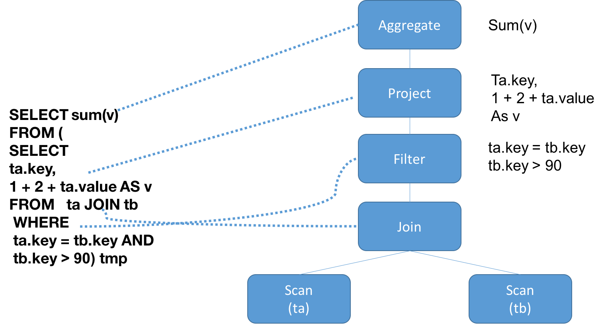

# Spark Sql Catalyst

Catalyst是spark官方为spark sql设计的query优化框架， 基于函数式编程语言Scala实现。Catalyst有一个优化规则库，可以针对spark sql语句进行自动分析优化。而且Catalyst利用Scala的强大语言特性，例如模式匹配和运行时元程序设计([基于scala quasiquotes](https://docs.scala-lang.org/overviews/quasiquotes/intro.html))，使得开发者可以简单方便的定制优化规则。

### TreeNode And Rule

`TreeNode`和`Rule`是Catalyst重要的两种类型。

#### TreeNode

在sql语句中，每条sql语句都会被解析为一个AST(abstract syntax tree)，而TreeNode就是spark sql抽象语法树中的节点。

TreeNode是一个抽象类，子类有很多种，比如可以是Projection，Attribute, Literal(常量)，或者是一个操作(比如Sum,Add)，或者是join,hashAggregate这些，或者filter,scan等等。

比如下面这条sql语句。

```sql
SELECT sum(v) 
FROM (
SELECT 
ta.key, 
1 + 2 + tb.value AS v
FROM   ta JOIN tb
 WHERE
 ta.key = tb.key AND 
 tb.key > 90) tmp
```

它会解析为一个AST。

```
== Parsed Logical Plan ==
'Project [unresolvedalias('sum('v), None)]
+- 'SubqueryAlias tmp
   +- 'Project ['ta.key, ((1 + 2) + 'ta.value) AS v#12]
      +- 'Filter (('ta.key = 'tb.key) && ('tb.value > 90))
         +- 'Join Inner
            :- 'UnresolvedRelation `ta`
            +- 'UnresolvedRelation `tb`
```




#### Rule

而Rule就是运用在这个AST上面的规则。通过规则对树里面的TreeNode进行转化。

观察TreeNode，里面有一个很重要的方法：

```scala
  def transform(rule: PartialFunction[BaseType, BaseType]): BaseType = {
    transformDown(rule)
  }
```

默认是对树中的TreeNode使用前序遍历方式（transformDown)进行转化，也可以使用后续遍历(transformUp)对TreeNode进行转化。

查看Rule的子类，发现有很多规则, 这些规则是很多种，在AST转换的各个阶段的规则都有，比如列裁剪，谓词下推，合并filter，展开projection等等。

RuleExecutor是一个用来执行rule的执行器，里面有一个batch字段，是一系列的rule，这些是作用在treeNode组成的tree之上，rule的执行策略有两种，一种是Once，只执行一次，另外一种是fixedPoint，意思是在rule一直作用在tree之上，直到tree达到一个不动点，不再改变。


### Catalyst In Spark Sql

spark sql是 apache spark的其中一个模块，主要用于进行结构化数据的处理。spark sql的底层执行还是调用rdd来执行。一条sql语句从String到RddChain的过程如下图所示。


SQL语句到转换为rdd总共分为以下阶段，[具体参考Spark sql 执行流程-从sql string 到 rdd](./Spark-sql-Analysis.md)

1. SQL 语句经过 SqlParser(ANTLR4) 解析成 Unresolved LogicalPlan;
2. 使用 analyzer 结合数据数据字典 (catalog) 进行绑定, 生成 resolved LogicalPlan;
3. 对 resolved LogicalPlan 进行优化, 生成 optimized LogicalPlan;
4. 将 LogicalPlan 转换成 PhysicalPlan;
5. 将 PhysicalPlan 转换成可执行物理计划;
6. 使用 execute() 执行可执行物理计划;
7. 生成 RDD。

而Catalyst参与其中的四个阶段，分别是：

- 将Unresolved Logical Plan转化为resolved logical plan

- logical plan 到optimized logical plan

- optimized logical plan 到physical plan

- code generation(在转换为可执行物理计划阶段)

在生成physical plan阶段，可能会使用CBO(cost based optimization，目前是用于join策略的选择),其他阶段都是RBO(rule based optimization)。


####  Analysis

Analysis阶段的输入是一个AST(抽象语法树)或者是一个DataFrame，称之为unresolved logic plan。因为这些plan中的元素属性都是未知的。比如上面举例的sql语句，是否存在ta这个表，ta这个表有没有key 和 value字段，以及这些字段的类型都是未知的。

`org.apache.spark.sql.catalyst.analysisAnalyzer`是一个用于执行analysis的类，这个类继承RuleExecutor，其中定义了一系列的解析规则顺序执行来解析这些字段和函数等里面的属性。

Spark sql使用Catalyst规则和catalog来查询这些表是否存在，并来获得查询需要的具体属性。

- 向catalog查询relations
- 根据属性的名字做映射
- 对名字相同的attribute给unique id标注：例如前面sql语句的ta.key =  tb.key， 会被解析为 key#1 = key#6
- 对expressions的类型做解析：例如 (cast((1 + 2) as bigint) + value#1L),  sum(v#12L) AS sum(v)#28L
- 如果有UDF，还要解析UDF
- 等等


下面就是resolved logical plan：

```
== Analyzed Logical Plan ==
sum(v): bigint
Aggregate [sum(v#12L) AS sum(v)#28L]
+- SubqueryAlias tmp
   +- Project [key#0, (cast((1 + 2) as bigint) + value#1L) AS v#12L]
      +- Filter ((key#0 = key#6) && (value#7L > cast(90 as bigint)))
         +- Join Inner
            :- SubqueryAlias ta, `ta`
            :  +- Relation[key#0,value#1L] json
            +- SubqueryAlias tb, `tb`
               +- Relation[key#6,value#7L] json
```

可以看出，每个attribute都有一个Unique ID，例如 key#0, sum(v)#28L

####  Logical Optimizations

在获得resolved logical plan之后，就对这个plan进行优化。

这个其实类似analyzer，`org.apache.spark.sql.catalyst.optimizer.Optimizer`同样是继承RuleExecutor，然后里面包含了一系列的优化策略。然后每个策略对Tree进行transform。主要的优化策略列表如下：

```
PushProjectionThroughUnion,
ReorderJoin,
EliminateOuterJoin,
PushPredicateThroughJoin,
PushDownPredicate,
LimitPushDown,
ColumnPruning,
InferFiltersFromConstraints,
// Operator combine
CollapseRepartition,
CollapseProject,
CollapseWindow,
CombineFilters,
CombineLimits,
CombineUnions,
// Constant folding and strength reduction
NullPropagation,
FoldablePropagation,
OptimizeIn(conf),
ConstantFolding,
ReorderAssociativeOperator,
LikeSimplification,
BooleanSimplification,
SimplifyConditionals,
RemoveDispensableExpressions,
SimplifyBinaryComparison,
PruneFilters,
EliminateSorts,
SimplifyCasts,
SimplifyCaseConversionExpressions,
RewriteCorrelatedScalarSubquery,
EliminateSerialization,
RemoveRedundantAliases,
RemoveRedundantProject
```
常见的谓词下推啊，常数合并，filter合并等等。

在我们上面的那条sql语句中，用到了谓词下推和常数合并，以及添加了isNotNull判断和filter合并等。下面就是优化之后逻辑计划。

我们可以看到在resolved logical plan中，filter条件在join之上，在优化之后，filter条件下推，这样可以提早过滤掉一部分数据，减小join部分的压力。

还有就是之前的`1+2`在这里已经转化为3，还有就是在filter里面都加了 `isNotNull`判断。

```
== Optimized Logical Plan ==
Aggregate [sum(v#12L) AS sum(v)#28L]
+- Project [(3 + value#1L) AS v#12L]
   +- Join Inner, (key#0 = key#6)
      :- Filter isnotnull(key#0)
      :  +- Relation[key#0,value#1L] json
      +- Project [key#6]
         +- Filter ((isnotnull(value#7L) && (value#7L > 90)) && isnotnull(key#6))
            +- Relation[key#6,value#7L] json
```


#### 物理计划

在获得 optimized logical plan之后，接下来就要准备可以执行的物理计划。观察上面的优化之后的逻辑计划，只说了join，但是怎么join，是broadcastJoin 还是 SortMergeJoin。 只有Relation[key#6,value#7L] json，但是去哪里获得数据，等等。物理计划就是要完善这部分。

同前面几个阶段相同，这个阶段也是一系列的策略：

```
def strategies: Seq[Strategy] =
    extraStrategies ++ (
    FileSourceStrategy ::
    DataSourceStrategy ::
    DDLStrategy ::
    SpecialLimits ::
    Aggregation ::
    JoinSelection ::
    InMemoryScans ::
    BasicOperators :: Nil)
```

可以看出这些策略是选择输入源相关，DDL策略相关，join等等。

前面部分粗略的提到过，Spark sql关于其他阶段的优化都是RBO，而join选择是基于CBO。目前CBO还在逐渐完善，可以关注[相关JIRA](https://issues.apache.org/jira/browse/SPARK-16026)

因为join的选择必须要基于表的大小相关的信息，才能做出好的选择。关注这个JoinSelection策略。

此处就选择一个方法，不再展开。

```scala
private def canBroadcast(plan: LogicalPlan): Boolean = {
  plan.statistics.isBroadcastable ||
    (plan.statistics.sizeInBytes >= 0 &&
      plan.statistics.sizeInBytes <= conf.autoBroadcastJoinThreshold)
}
```

可以看到这个方法判断是否能够broadcast的规则就是通过统计的数据, statistics中的sizeInBytes大小，来判断这个表的大小是否超过broadcast参数设置的阈值，如果小于阈值，则选用broadcastJoin，这样可以避免shuffle。


#### Code Generation

上面的物理计划阶段得到的只是一个中间阶段的物理计划，要想物理计划阶段得以运行还要进行一系列操作，这部分体现在`org.apache.spark.sql.execution.QueryExecution类的preparations方法中`.

```scala
/** A sequence of rules that will be applied in order to the physical plan before execution. */
protected def preparations: Seq[Rule[SparkPlan]] = Seq(
  python.ExtractPythonUDFs,
  PlanSubqueries(sparkSession),
  EnsureRequirements(sparkSession.sessionState.conf),
  CollapseCodegenStages(sparkSession.sessionState.conf),
  ReuseExchange(sparkSession.sessionState.conf),
  ReuseSubquery(sparkSession.sessionState.conf))
```

这里会添加排序，分区策略，codegen。

排序，分区就是类似于 spark core中的shuffle阶段。而codegen是Catalyst中的重要内容。

由于spark sql是操纵内存中的datasets，cpu是一个重要的瓶颈，因此codegen就是为了生成高效的代码，来加速性能。Catalyst的codegen依赖scala的一个特性 [quasiquotes](https://docs.scala-lang.org/overviews/quasiquotes/intro.html)来使得codegen变得简单。

codeGen是给一些可以进行codeGen的例子，制定了一套通用的模板，固定的部分是相同的，定制的部分传入一些具体的参数，然后可以运行时编程运行，如下。

```scala
val source = s"""
  public Object generate(Object[] references) {
    return new GeneratedIterator(references);
  }

  ${ctx.registerComment(s"""Codegend pipeline for\n${child.treeString.trim}""")}
  final class GeneratedIterator extends org.apache.spark.sql.execution.BufferedRowIterator {

    private Object[] references;
    private scala.collection.Iterator[] inputs;
    ${ctx.declareMutableStates()}

    public GeneratedIterator(Object[] references) {
      this.references = references;
    }

    public void init(int index, scala.collection.Iterator[] inputs) {
      partitionIndex = index;
      this.inputs = inputs;
      ${ctx.initMutableStates()}
      ${ctx.initPartition()}
    }

    ${ctx.declareAddedFunctions()}

    protected void processNext() throws java.io.IOException {
      ${code.trim}
    }
  }
  """.trim
```

最终得到可执行的物理计划，如下所示。

```
== Physical Plan ==
*HashAggregate(keys=[], functions=[sum(v#12L)], output=[sum(v)#28L])
+- Exchange SinglePartition
   +- *HashAggregate(keys=[], functions=[partial_sum(v#12L)], output=[sum#30L])
      +- *Project [(3 + value#1L) AS v#12L]
         +- *BroadcastHashJoin [key#0], [key#6], Inner, BuildRight
            :- *Project [key#0, value#1L]
            :  +- *Filter isnotnull(key#0)
            :     +- *FileScan json [key#0,value#1L] Batched: false, Format: JSON, Location: InMemoryFileIndex[file:/Users/bbw/todo/sparkApp/data/kv.json], PartitionFilters: [], PushedFilters: [IsNotNull(key)], ReadSchema: struct<key:string,value:bigint>
            +- BroadcastExchange HashedRelationBroadcastMode(List(input[0, string, true]))
               +- *Project [key#6]
                  +- *Filter ((isnotnull(value#7L) && (value#7L > 17)) && isnotnull(key#6))
                     +- *FileScan json [key#6,value#7L] Batched: false, Format: JSON, Location: InMemoryFileIndex[file:/Users/bbw/todo/sparkApp/data/kv.json], PartitionFilters: [], PushedFilters: [IsNotNull(value), GreaterThan(value,90), IsNotNull(key)], ReadSchema: struct<key:string,value:bigint>
```

可以看出，可执行计划里给了Location，到哪里去读数据。broadcastExchange，怎么分配数据。BroadcastHashJoin，进行什么种类的join等等。

后面就可以转化为RDD。

### 添加自己的Rule

这里有一个查询，如下：


```scala
import org.apache.spark.sql.functions._
val tableA = spark.range(20000000).as('a) 
val tableB = spark.range(10000000).as('b) 
val result= tableA.join(tableB,Seq("id"))
    .groupBy()
    .count()
result.show()
```
物理计划如下，耗时33秒：


```
== Physical Plan ==
*HashAggregate(keys=[], functions=[count(1)])
+- Exchange SinglePartition
   +- *HashAggregate(keys=[], functions=[partial_count(1)])
      +- *Project
         +- *SortMergeJoin [id#0L], [id#4L], Inner
            :- *Sort [id#0L ASC NULLS FIRST], false, 0
            :  +- Exchange hashpartitioning(id#0L, 200)
            :     +- *Range (0, 20000000, step=1, splits=Some(1))
            +- *Sort [id#4L ASC NULLS FIRST], false, 0
               +- Exchange hashpartitioning(id#4L, 200)
                  +- *Range (0, 10000000, step=1, splits=Some(1))
```
tableA 和tableB 都是一个range，一个是[0,19999999]，另外一个[0,9999999],让两个表求交集。

其实可以添加优化规则，判断两个range的start 和 end，来求区间的交集。

因此我们添加了一个Rule，如下。

```scala
import org.apache.spark.SparkConf
import org.apache.spark.sql.SparkSession
import org.apache.spark.sql.execution.{ProjectExec, RangeExec, SparkPlan}
import org.apache.spark.sql.Strategy
import org.apache.spark.sql.catalyst.expressions.{Alias, EqualTo}
import org.apache.spark.sql.catalyst.plans.Inner
import org.apache.spark.sql.catalyst.plans.logical.{Join, LogicalPlan, Range}

case object IntervalJoin extends Strategy with Serializable {
  def apply(plan: LogicalPlan): Seq[SparkPlan] = plan match {
    case Join(Range(start1, end1, 1, part1, Seq(o1)),
    Range(start2, end2, 1, part2, Seq(o2)),
    Inner, Some(EqualTo(e1, e2)))
      if ((o1 semanticEquals e1) && (o2 semanticEquals e2)) ||
        ((o1 semanticEquals e2) && (o2 semanticEquals e1)) =>
      if ((end2 >= start1) && (end2 <= end2)) {
        val start = math.max(start1, start2)
        val end = math.min(end1, end2)
        val part = math.max(part1.getOrElse(200), part2.getOrElse(200))
        val result = RangeExec(Range(start, end, 1, Some(part), o1 :: Nil))
        val twoColumns = ProjectExec(
          Alias(o1, o1.name)(exprId = o1.exprId) :: Nil,
          result)
        twoColumns :: Nil
      }
      else {
        Nil
      }
    case _ => Nil


  }
}

//添加规则到外部规则列表中， spark is a spark session
spark.experimental.extraStrategies = IntervalJoin :: Nil

```

物理计划如下，耗时0.5s:

```
== Physical Plan ==
*HashAggregate(keys=[], functions=[count(1)])
+- Exchange SinglePartition
   +- *HashAggregate(keys=[], functions=[partial_count(1)])
      +- *Project
         +- *Project [id#0L AS id#0L]
            +- *Range (0, 10000000, step=1, splits=Some(1))
```


### 参考文献

https://databricks.com/session/a-deep-dive-into-spark-sqls-catalyst-optimizer

https://databricks.com/blog/2015/04/13/deep-dive-into-spark-sqls-catalyst-optimizer.html

https://databricks.com/blog/2017/08/31/cost-based-optimizer-in-apache-spark-2-2.html

