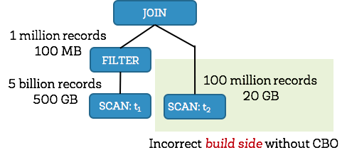

# spark sql cbo

[DataBricks官方关于spark cbo博客](https://databricks.com/blog/2017/08/31/cost-based-optimizer-in-apache-spark-2-2.html)。

[Spark cbo译文](https://www.cnblogs.com/shishanyuan/p/8453587.html)

[Cost-based Optimizer Framework-Jira](https://issues.apache.org/jira/browse/SPARK-16026)

[Spark CBO PDF](https://issues.apache.org/jira/secure/attachment/12823839/Spark_CBO_Design_Spec.pdf)

Spark catalyst里面的优化绝大多数都是基于规则的优化，称之为rule based optimization(RBO)，RBO都是基于经验的优化。而本文中的CBO(cost based optimization)是基于代价的优化，这两种优化是相辅相成的关系，因为有些时候只有RBO是不够的。

我们都知道定性分析与定量分析，RBO就是定性分析，它只关注query的属性，而忽略处理的量。而CBO就是定量分析。

举一个简单的例子，有两张表做hash join操作。spark选择小的表当做hash端，然后大表来探测小表进行hash join。如下图是一个join的例子，只不过这个例子中存在filter操作。

如果是spark 2.1版本，spark会选择右边的小表做hash端，但是大表经过filter操作只有100MB大小，因此这就导致选择了一个错误的方式进行hash join， 而且造成内存紧张。

在spark2.2版本，spark通过为每个operator进行统计，可以识别出左边的表经过filter其实只有100MB，通过正确的统计，spark2.2可以选择左边的表作为build端，从而得到一个好的性能。

