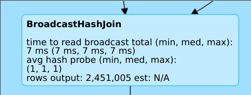
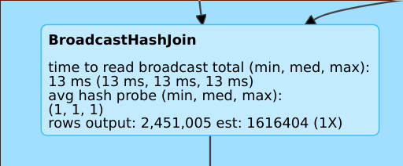
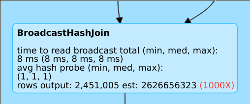

 

# spark sql cbo

## What is cbo?

Spark catalyst里面的优化绝大多数都是基于规则的优化，称之为rule based optimization(RBO)，RBO都是基于经验的优化。而本文中的CBO(cost based optimization)是基于代价的优化，这两种优化是相辅相成的关系，因为有些时候只有RBO是不够的。

我们都知道定性分析与定量分析，RBO就是定性分析，它只关注query的属性，而忽略处理的量。而CBO就是定量分析。

## Why need cbo?

举一个简单的例子，有两张表做hash join操作。spark选择小的表当做hash端，然后大表来探测小表进行hash join。如下图是一个join的例子，只不过这个例子中存在filter操作。


如果是spark 2.1版本，spark会选择右边的小表做hash端，但是大表经过filter操作只有100MB大小，因此这就导致选择了一个错误的方式进行hash join， 而且造成内存紧张。

在spark2.2版本，spark通过为每个operator进行统计，可以识别出左边的表经过filter其实只有100MB，通过正确的统计，spark2.2可以选择左边的表作为build端，从而得到一个好的性能。


是在选择Join策略时，应该选择什么样的Join，是BroadcastJoin还是ShuffleHashJoin还是SortMergeJoin？不同的执行策略对系统的资源要求不同，执行效率也有很大差别。选择到合适的策略可能只需要花费几秒钟时间，而选择到不合适的策略可能会导致系统OOM。

在进行多表join时应该选择什么样的顺序来执行，不同的join顺序意味着不同的执行效率。比如A join B join C,  A,B表都很大， C表很小。那么A join B需要很大的系统资源来计算。而如果使用A join C join B， 由于C表很小，所以A join C会很快，而且计算之后的结果集也很小，之后再join B,这样的顺序效果明显比 A join B join C要快的多。

首先来看 broadcast 还是 shuffle hash 或者 sortmerge join选择的问题，当前sparksql 会让用户指定参数`spark.sql.autoBroadcastJoinThreshold`来决定是否采用broadcastJoin策略，简单的说他会选择参与join中两个表中较小表的大小与该值进行比较，如果小于这个阈值，就进行broadcastJoin，反之，则不采用。

- 这个阈值只考虑表大小缺不考虑标的条数。这合理么？我们知道join会将两个表中key相同的记录合并在一起，因此join的复杂度与标的条数有着直接的关系。因此这里的broadcastJoinThreshold，只考虑了广播传输数据的代价，缺不是join本身的代价。

- 在catalyst里面有谓词下推规则，也就是说两个表join时，如果有过滤条件，会首先对表进行过滤再进行join， 因此join的两个表大小并不是原始大小，因此单纯的知道原始表的大小还远远不够，还需要评估过滤之后数据大小以及表的条数。

- 同样对于多个表join的情况，单纯知道表的大小也是不够的，如果有过滤条件，即使B表较大， 但是B经过过滤之后是最小的，那么按照原始表大小来决定的join顺序也不是最优的。

因此，需要CBO来统计信息，基于代价来作出决策。

  

## How to cbo?

华为给社区贡献了CBO方面的[PR，这里是相关Jira](https://issues.apache.org/jira/browse/SPARK-16026)。

上面说了需要统计表的详细信息，`org.apache.spark.sql.catalyst.plans.logical.Statistics`是统计信息的类。

```scala
/**
 * Estimates of various statistics.  The default estimation logic simply lazily multiplies the
 * corresponding statistic produced by the children.  To override this behavior, override
 * `statistics` and assign it an overridden version of `Statistics`.
 *
 * '''NOTE''': concrete and/or overridden versions of statistics fields should pay attention to the
 * performance of the implementations.  The reason is that estimations might get triggered in
 * performance-critical processes, such as query plan planning.
 *
 * Note that we are using a BigInt here since it is easy to overflow a 64-bit integer in
 * cardinality estimation (e.g. cartesian joins).
 *
 * @param sizeInBytes Physical size in bytes. For leaf operators this defaults to 1, otherwise it
 *                    defaults to the product of children's `sizeInBytes`.
 * @param rowCount Estimated number of rows.
 * @param attributeStats Statistics for Attributes.
 * @param hints Query hints.
 */
case class Statistics(
    sizeInBytes: BigInt,
    rowCount: Option[BigInt] = None,
    attributeStats: AttributeMap[ColumnStat] = AttributeMap(Nil),
    hints: HintInfo = HintInfo()) {

  override def toString: String = "Statistics(" + simpleString + ")"

  /** Readable string representation for the Statistics. */
  def simpleString: String = {
    Seq(s"sizeInBytes=${Utils.bytesToString(sizeInBytes)}",
      if (rowCount.isDefined) {
        // Show row count in scientific notation.
        s"rowCount=${BigDecimal(rowCount.get, new MathContext(3, RoundingMode.HALF_UP)).toString()}"
      } else {
        ""
      },
      s"hints=$hints"
    ).filter(_.nonEmpty).mkString(", ")
  }
}
```

可以看到这个类里目前有sizeInBytes，rowCount，一系列的ColumnStat(列信息统计), HintInfo(与join有关)。

用户可以使用命令来查询显示这些信息。

```sql
ANALYZE TABLE table_name COMPUTE STATISTICS
```

也可以加一些条件。

```sql
ANALYZE TABLE table_name COMPUTE STATISTICS FOR COLUMNS column-name1, column-name2, ….
```


在打开`spark.sql.cbo.enable`相关参数之后，使用explain命令，会显示详细信息。

```sql
== Optimized Logical Plan ==
Aggregate [s_store_sk], [s_store_sk, count(1) AS count(1)L], Statistics(sizeInBytes=20.0 B, rowCount=1, hints=none)
+- Project [s_store_sk], Statistics(sizeInBytes=18.5 MB, rowCount=1.62E+6, hints=none)
   +- Join Inner, (d_date_sk = ss_sold_date_sk), Statistics(sizeInBytes=30.8 MB, rowCount=1.62E+6, hints=none)
      :- Project [ss_sold_date_sk, s_store_sk], Statistics(sizeInBytes=39.1 GB, rowCount=2.63E+9, hints=none)
      :  +- Join Inner, (s_store_sk = ss_store_sk), Statistics(sizeInBytes=48.9 GB, rowCount=2.63E+9, hints=none)
      :     :- Project [ss_store_sk, ss_sold_date_sk], Statistics(sizeInBytes=39.1 GB, rowCount=2.63E+9, hints=none)
      :     :  +- Filter (isnotnull(ss_store_sk) && isnotnull(ss_sold_date_sk)), Statistics(sizeInBytes=39.1 GB, rowCount=2.63E+9, hints=none)
      :     :     +- Relation[ss_store_sk,ss_sold_date_sk] parquet, Statistics(sizeInBytes=134.6 GB, rowCount=2.88E+9, hints=none)
      :     +- Project [s_store_sk], Statistics(sizeInBytes=11.7 KB, rowCount=1.00E+3, hints=none)
      :        +- Filter isnotnull(s_store_sk), Statistics(sizeInBytes=11.7 KB, rowCount=1.00E+3, hints=none)
      :           +- Relation[s_store_sk] parquet, Statistics(sizeInBytes=88.0 KB, rowCount=1.00E+3, hints=none)
      +- Project [d_date_sk], Statistics(sizeInBytes=12.0 B, rowCount=1, hints=none)
         +- Filter ((((isnotnull(d_year) && isnotnull(d_date)) && (d_year = 2000)) && (d_date = 2000-12-31)) && isnotnull(d_date_sk)), Statistics(sizeInBytes=38.0 B, rowCount=1, hints=none)
            +- Relation[d_date_sk,d_date,d_year] parquet, Statistics(sizeInBytes=1786.7 KB, rowCount=7.30E+4, hints=none)

```

可以看到这里面显示了sizeInBytes，rowCount,hints这些信息。

rowCount的信息在join时是非常重要的，如果rowcount的信息没有显示，那么意味着没有足够的信息来估测（一些需要的列缺少统计信息).

### Spark Sql UI

 使用Spark sql 的webUI也可以看到plan的统计信息。如下:


这里看到row count 的统计信息为N/A。

这里看到row count 的统计信息后缀有(1X)，代表预估比较精准。

这里看到row count 的统计信息后缀有(1000X)，代表预估与实际值差1000倍数量级，是一个很差的预估。


### 代价函数

知道了上面的统计信息，那么如何根据这些统计信息选择合适的执行策略呢？这就需要代价函数，以统计的信息作为参数，计算不同策略的代价，来选择合适的策略。

这部分太过专业，具体，详情可以看[华为的PDF文档](https://issues.apache.org/jira/secure/attachment/12823839/Spark_CBO_Design_Spec.pdf)以及[DataBricks官方关于spark cbo博客](https://databricks.com/blog/2017/08/31/cost-based-optimizer-in-apache-spark-2-2.html).


## References

[DataBricks官方关于spark cbo博客](https://databricks.com/blog/2017/08/31/cost-based-optimizer-in-apache-spark-2-2.html)

[DataBricks documation](https://docs.databricks.com/spark/latest/spark-sql/cbo.html)

[Spark cbo译文](https://www.cnblogs.com/shishanyuan/p/8453587.html)

[Cost-based Optimizer Framework-Jira](https://issues.apache.org/jira/browse/SPARK-16026)

[Spark CBO PDF](https://issues.apache.org/jira/secure/attachment/12823839/Spark_CBO_Design_Spec.pdf)

